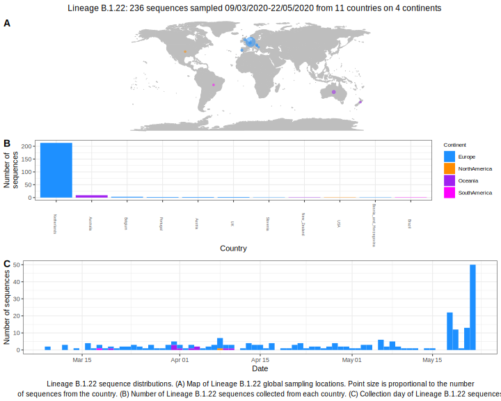

<ul class="actions small">
	 <a href="{{ 'lineages/lineage_B.1.html' | absolute_url }}" class="button special fit">Go to parent lineage: B.1</a>
</ul>

<h3> Lineage summaries</h3>

| Lineage name | Most common countries | Date range | Number of taxa | Known Travel | Recall value |
|:-----|:-----|:-------|-------:|-------:|:---------|--------:|
| <a href="{{ 'lineages/lineage_B.1.22.html' | absolute_url }}">B.1.22</a> | Netherlands (84%), UK (8%), Australia (2%) | March 09 to October 08 | 261 |  | 1.0 |

<h3>Lineage descriptions</h3>

| Lineage | Notes |
|:-----|:-----|
| <a href="{{ 'lineages/lineage_B.1.22.html' | absolute_url }}">B.1.22</a> | Netherlands lineage, now with some European sequences and some Australian sequences  |

