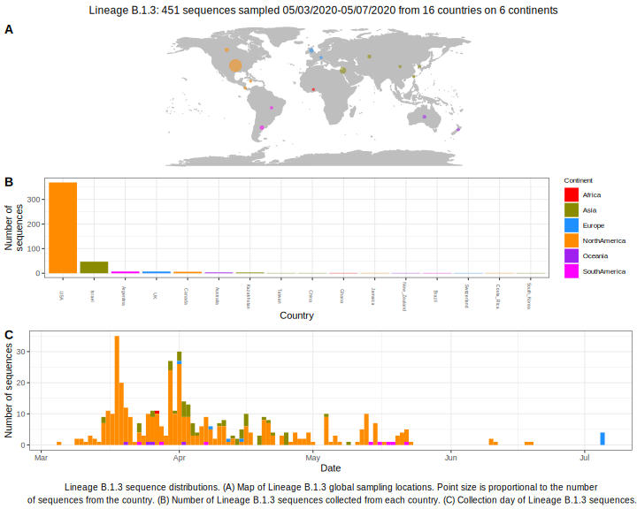

<ul class="actions small">
	 <a href="{{ 'lineages/lineage_B.1.html' | absolute_url }}" class="button special fit">Go to parent lineage: B.1</a>
</ul>

<h3> Lineage summaries</h3>

| Lineage name | Most common countries | Date range | Number of taxa | Known Travel | Recall value |
|:-----|:-----|:-------|-------:|-------:|:---------|--------:|
| <a href="{{ 'lineages/lineage_B.1.3.html' | absolute_url }}">B.1.3</a> | USA (73%), UK (12%), Israel (10%) | March 05 to July 29 | 451 |  | 0.99 |
| <a href="{{ 'lineages/lineage_B.1.3.1.html' | absolute_url }}">B.1.3.1</a> | South_Korea (100%) | May 05 to July 11 | 130 |  | 1.0 |

<h3>Lineage descriptions</h3>

| Lineage | Notes |
|:-----|:-----|
| <a href="{{ 'lineages/lineage_B.1.3.html' | absolute_url }}">B.1.3</a> | USA lineage |
| <a href="{{ 'lineages/lineage_B.1.3.1.html' | absolute_url }}">B.1.3.1</a> | South Korean lineage |

