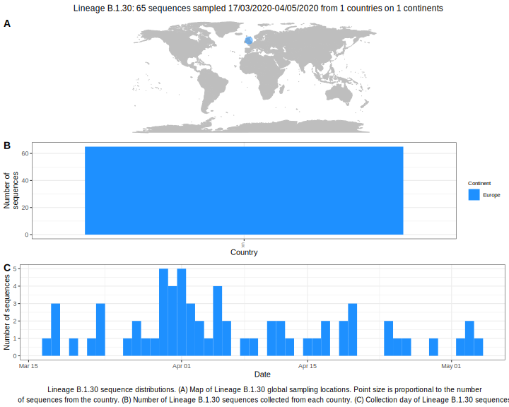

| Lineage | Notes |
|:-----|:-----|
| B.1.30 | England (BS=100) |

<h2>Lineage B.1.30 composition summary </h2>

<strong>Total number of sequences:</strong> 60

| Lineage name | Most common countries | Date range | Number of taxa |  Days since last sampling | Known Travel | Recall value |
|:-----|:-----|:-------|-------:|-------:|:---------|--------:|
| B.1.30 | UK (100%) | March 17 to May 03 | 60 | 7 |  | 100.0 |
