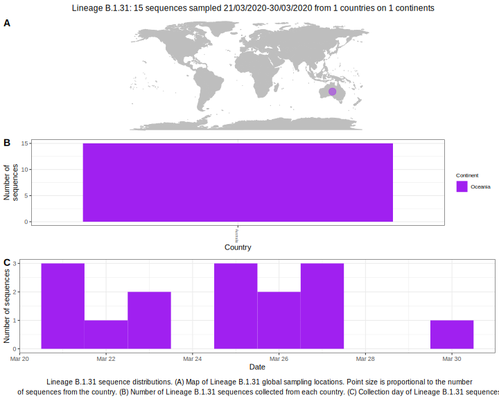

| Lineage | Notes |
|:-----|:-----|
| B.1.31 | Australia (BS=100) |

<h2>Lineage B.1.31 composition summary </h2>

<strong>Total number of sequences:</strong> 10

| Lineage name | Most common countries | Date range | Number of taxa |  Days since last sampling | Known Travel | Recall value |
|:-----|:-----|:-------|-------:|-------:|:---------|--------:|
| B.1.31 | Australia (100%) | March 21 to March 27 | 10 | 44 |  | 100.0 |
