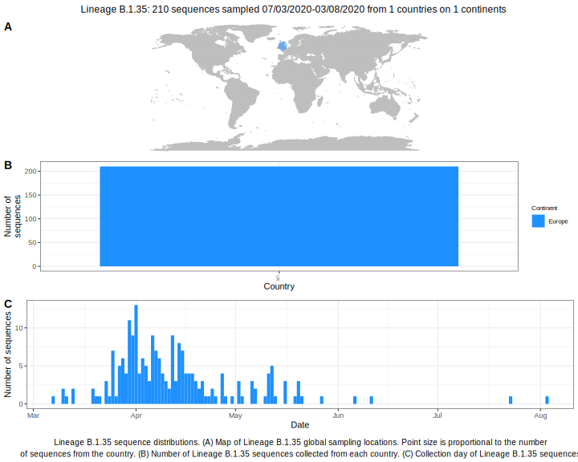

| Lineage | Notes |
|:-----|:-----|
| B.1.35 | Wales (BS=9) |

<h2>Lineage B.1.35 composition summary </h2>

<strong>Total number of sequences:</strong> 112

| Lineage name | Most common countries | Date range | Number of taxa |  Days since last sampling | Known Travel | Recall value |
|:-----|:-----|:-------|-------:|-------:|:---------|--------:|
| B.1.35 | UK (100%) | March 07 to April 22 | 112 | 18 |  | 100.0 |
