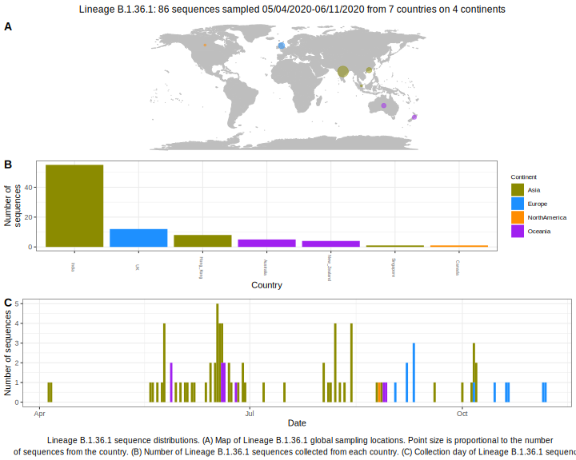

<ul class="actions small">
	 <a href="{{ 'lineages/lineage_B.1.36.html' | absolute_url }}" class="button special fit">Go to parent lineage: B.1.36</a>
</ul>

<h3> Lineage summaries</h3>

| Lineage name | Most common countries | Date range | Number of taxa | Known Travel | Recall value |
|:-----|:-----|:-------|-------:|-------:|:---------|--------:|
| <a href="{{ 'lineages/lineage_B.1.36.1.html' | absolute_url }}">B.1.36.1</a> | UK (91%), India (5%), New_Zealand (1%) | May 11 to October 19 | 1051 |  | 0.94 |

<h3>Lineage descriptions</h3>

| Lineage | Notes |
|:-----|:-----|
| <a href="{{ 'lineages/lineage_B.1.36.1.html' | absolute_url }}">B.1.36.1</a> | Indian lineage |

