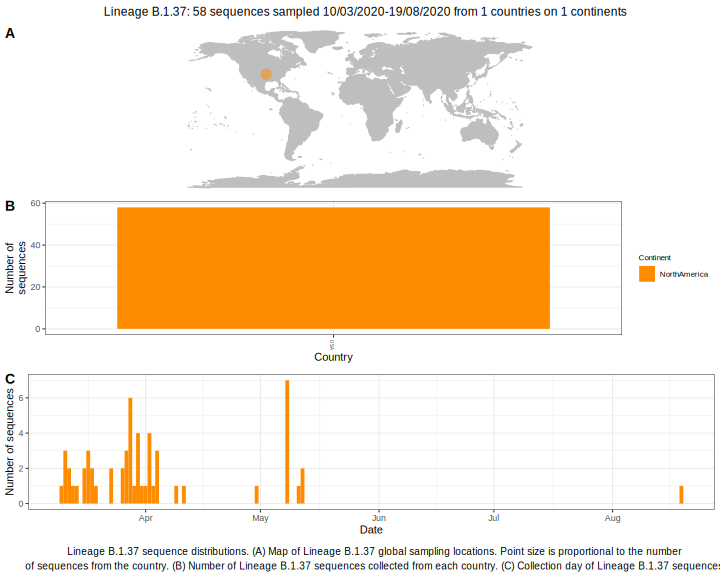

| Lineage | Notes |
|:-----|:-----|
| B.1.37 | USA lineage (BS=93) |

<h2>Lineage B.1.37 composition summary </h2>

<strong>Total number of sequences:</strong> 23

| Lineage name | Most common countries | Date range | Number of taxa |  Days since last sampling | Known Travel | Recall value |
|:-----|:-----|:-------|-------:|-------:|:---------|--------:|
| B.1.37 | USA (100%) | March 12 to April 04 | 23 | 36 |  | 100.0 |
