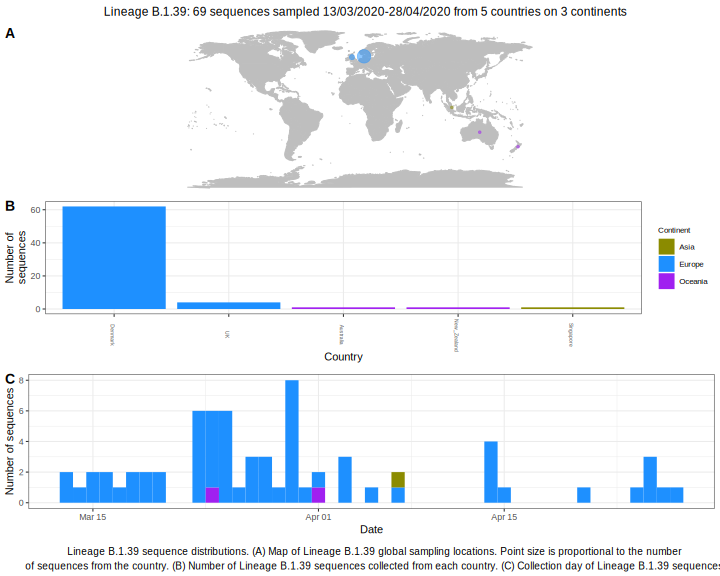

<h2> Lineage summaries</h2>

| Lineage name | Most common countries | Date range | Number of taxa |  Days since last sampling | Known Travel | Recall value |
|:-----|:-----|:-------|-------:|-------:|:---------|--------:|
| B.1.39 | Denmark (89%), UK (8%), Australia (3%) | March 13 to April 07 | 36 | 33 |  | 97.3 |

<h2>Lineage descriptions</h2>

| Lineage | Notes |
|:-----|:-----|
| B.1.39 | Denmark (BS=100) |

