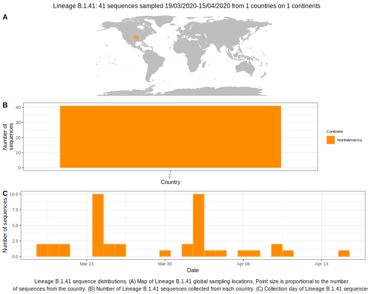

| Lineage | Notes |
|:-----|:-----|
| B.1.41 | USA lineage (BS=100) |

<h2>Lineage B.1.41 composition summary </h2>

<strong>Total number of sequences:</strong> 31

| Lineage name | Most common countries | Date range | Number of taxa |  Days since last sampling | Known Travel | Recall value |
|:-----|:-----|:-------|-------:|-------:|:---------|--------:|
| B.1.41 | USA (100%) | March 19 to April 09 | 31 | 31 |  | 96.55 |
