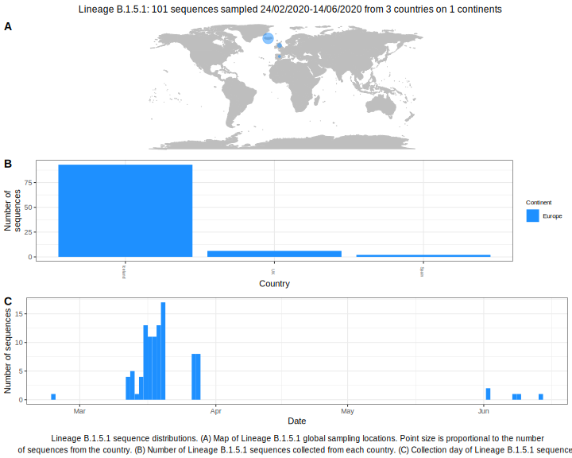

<h2> Lineage summaries</h2>

| Lineage name | Most common countries | Date range | Number of taxa |  Days since last sampling | Known Travel | Recall value |
|:-----|:-----|:-------|-------:|-------:|:---------|--------:|
| B.1.5.1 | Iceland (100%) | March 12 to March 28 | 93 | 43 | Argentina to Iceland (1)  | 100.0 |

<h2>Lineage descriptions</h2>

| Lineage | Notes |
|:-----|:-----|
| B.1.5.1 | Iceland (BS=27), but all sequences suggest an Icelandic lineage |

