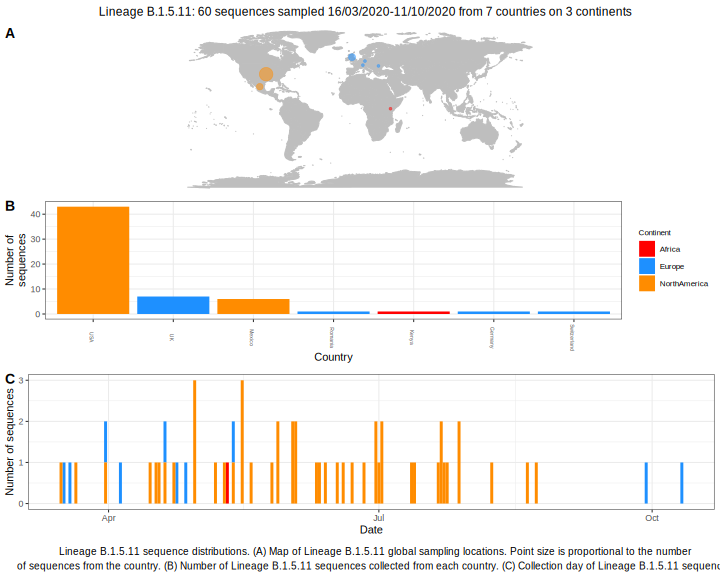

<ul class="actions small">
	 <a href="{{ 'lineages/lineage_B.1.5.html' | absolute_url }}" class="button special fit">Go to parent lineage: B.1.5</a>
</ul>

<h3> Lineage summaries</h3>

| Lineage name | Most common countries | Date range | Number of taxa |  Days since last sampling | Known Travel | Recall value |
|:-----|:-----|:-------|-------:|-------:|:---------|--------:|
| <a href="{{ 'lineages/lineage_B.1.5.11.html' | absolute_url }}">B.1.5.11</a> | USA (86%), Mexico (7%), Romania (3%) | March 19 to June 22 | 29 | 61 |  | 0.93 |

<h3>Lineage descriptions</h3>

| Lineage | Notes |
|:-----|:-----|
| <a href="{{ 'lineages/lineage_B.1.5.11.html' | absolute_url }}">B.1.5.11</a> | USA lineage |

