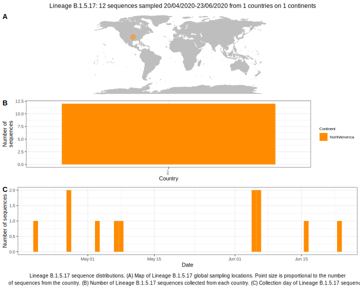

<ul class="actions small">
	 <a href="{{ 'lineages/lineage_B.1.5.html' | absolute_url }}" class="button special fit">Go to parent lineage: B.1.5</a>
</ul>

<h3> Lineage summaries</h3>

| Lineage name | Most common countries | Date range | Number of taxa | Known Travel | Recall value |
|:-----|:-----|:-------|-------:|-------:|:---------|--------:|
| <a href="{{ 'lineages/lineage_B.1.5.17.html' | absolute_url }}">B.1.5.17</a> | USA (56%), UK (41%), Spain (3%) | April 10 to September 16 | 34 |  | 0.35 |

<h3>Lineage descriptions</h3>

| Lineage | Notes |
|:-----|:-----|
| <a href="{{ 'lineages/lineage_B.1.5.17.html' | absolute_url }}">B.1.5.17</a> | USA lineage (OR & AK) |

