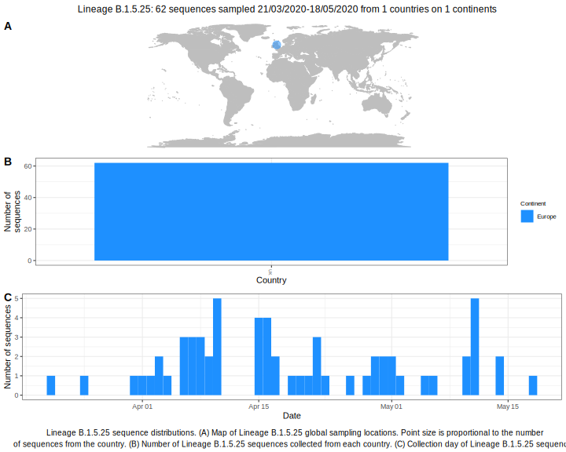

<ul class="actions small">
	 <a href="{{ 'lineages/lineage_B.1.5.html' | absolute_url }}" class="button special fit">Go to parent lineage: B.1.5</a>
</ul>

<h3> Lineage summaries</h3>

| Lineage name | Most common countries | Date range | Number of taxa |  Days since last sampling | Known Travel | Recall value |
|:-----|:-----|:-------|-------:|-------:|:---------|--------:|
| <a href="{{ 'lineages/lineage_B.1.5.25.html' | absolute_url }}">B.1.5.25</a> | UK (100%) | March 21 to May 18 | 62 | 96 |  | 0.95 |

<h3>Lineage descriptions</h3>

| Lineage | Notes |
|:-----|:-----|
| <a href="{{ 'lineages/lineage_B.1.5.25.html' | absolute_url }}">B.1.5.25</a> | UK lineage (previously B.1.99) |

