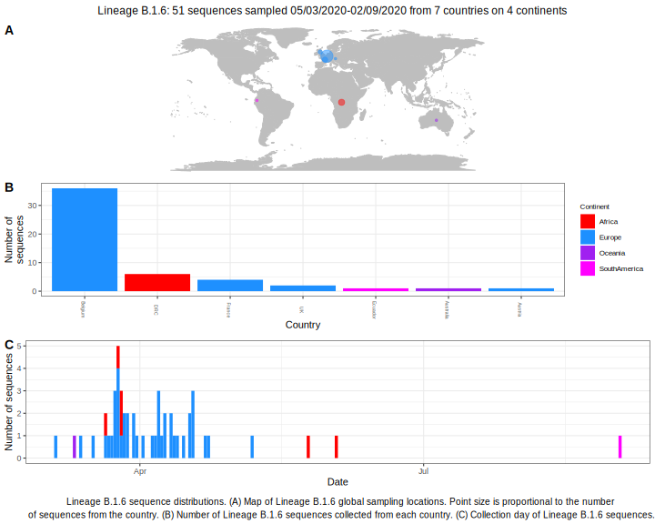

| Lineage | Notes |
|:-----|:-----|
| B.1.6 | Belgian lineage (BS=55) |

<h2>Lineage B.1.6 composition summary </h2>

<strong>Total number of sequences:</strong> 22

| Lineage name | Most common countries | Date range | Number of taxa |  Days since last sampling | Known Travel | Recall value |
|:-----|:-----|:-------|-------:|-------:|:---------|--------:|
| B.1.6 | Belgium (68%), DRC (18%), UK (9%) | March 11 to April 13 | 22 | 27 |  | 100.0 |
