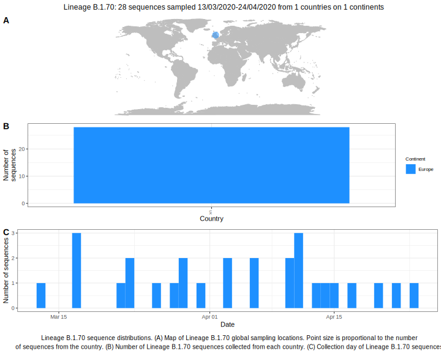

| Lineage | Notes |
|:-----|:-----|
| B.1.70 | Scottish lineage (BS=70) |

<h2>Lineage B.1.70 composition summary </h2>

<strong>Total number of sequences:</strong> 19

| Lineage name | Most common countries | Date range | Number of taxa |  Days since last sampling | Known Travel | Recall value |
|:-----|:-----|:-------|-------:|-------:|:---------|--------:|
| B.1.70 | UK (100%) | March 13 to April 20 | 19 | 20 |  | 100.0 |
