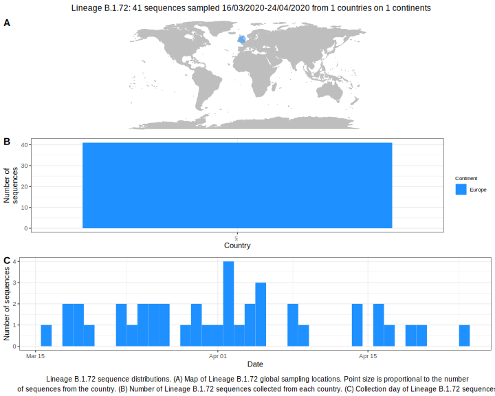

| Lineage | Notes |
|:-----|:-----|
| B.1.72 | UK lineage (BRIS) (BS=100) |

<h2>Lineage B.1.72 composition summary </h2>

<strong>Total number of sequences:</strong> 29

| Lineage name | Most common countries | Date range | Number of taxa |  Days since last sampling | Known Travel | Recall value |
|:-----|:-----|:-------|-------:|-------:|:---------|--------:|
| B.1.72 | UK (100%) | March 16 to April 05 | 29 | 35 |  | 100.0 |
