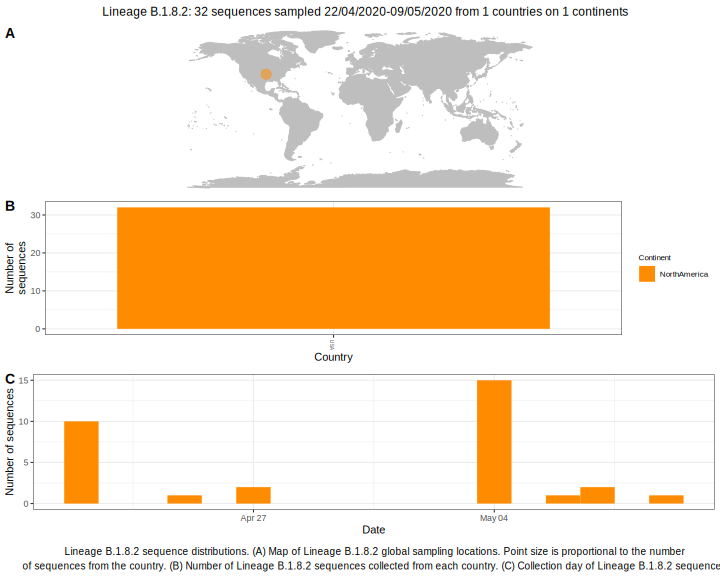

<ul class="actions small">
	 <a href="{{ 'lineages/lineage_B.1.8.html' | absolute_url }}" class="button special fit">Go to parent lineage: B.1.8</a>
</ul>

<h3> Lineage summaries</h3>

| Lineage name | Most common countries | Date range | Number of taxa |  Days since last sampling | Known Travel | Recall value |
|:-----|:-----|:-------|-------:|-------:|:---------|--------:|
| <a href="{{ 'lineages/lineage_B.1.8.2.html' | absolute_url }}">B.1.8.2</a> | USA (100%) | April 22 to May 07 | 19 | 107 |  | 1.0 |

<h3>Lineage descriptions</h3>

| Lineage | Notes |
|:-----|:-----|
| <a href="{{ 'lineages/lineage_B.1.8.2.html' | absolute_url }}">B.1.8.2</a> | USA (CA) lineage |

