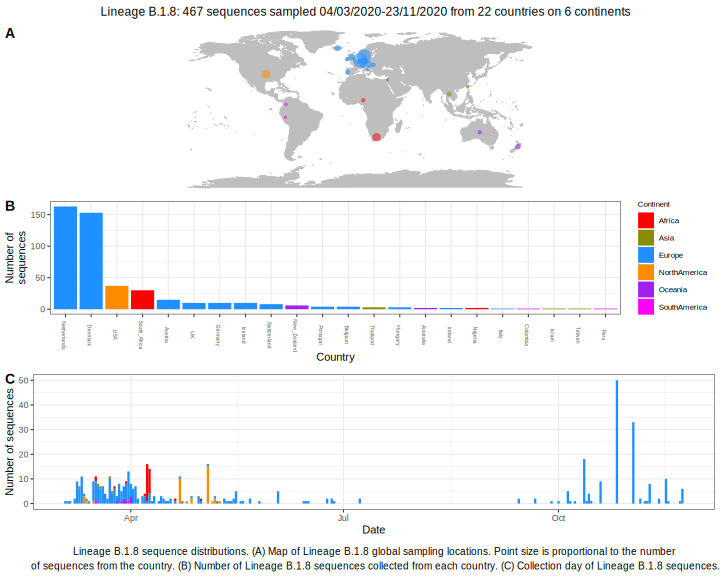

<ul class="actions small">
	 <a href="{{ 'lineages/lineage_B.1.html' | absolute_url }}" class="button special fit">Go to parent lineage: B.1</a>
</ul>

<h3> Lineage summaries</h3>

| Lineage name | Most common countries | Date range | Number of taxa |  Days since last sampling | Known Travel | Recall value |
|:-----|:-----|:-------|-------:|-------:|:---------|--------:|
| <a href="{{ 'lineages/lineage_B.1.8.html' | absolute_url }}">B.1.8</a> | Netherlands (63%), Iceland (12%), Austria (6%) | March 04 to April 11 | 83 | 29 | Austria to Iceland (10)  | 98.81 |

<h3>Lineage descriptions</h3>

| Lineage | Notes |
|:-----|:-----|
| <a href="{{ 'lineages/lineage_B.1.8.html' | absolute_url }}">B.1.8</a> | Netherlands/ Europe (BS=47) |

