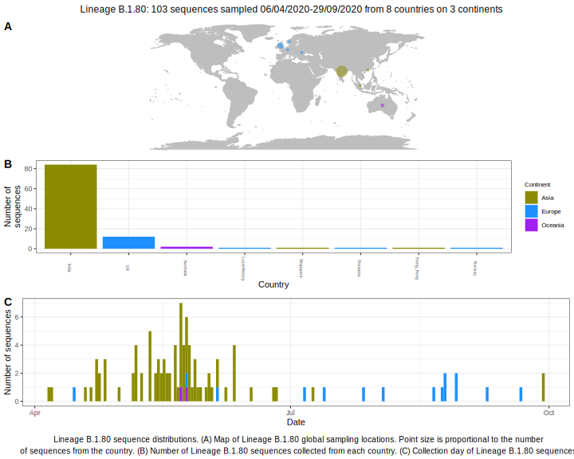

<ul class="actions small">
	 <a href="{{ 'lineages/lineage_B.1.html' | absolute_url }}" class="button special fit">Go to parent lineage: B.1</a>
</ul>

<h3> Lineage summaries</h3>

| Lineage name | Most common countries | Date range | Number of taxa |  Days since last sampling | Known Travel | Recall value |
|:-----|:-----|:-------|-------:|-------:|:---------|--------:|
| <a href="{{ 'lineages/lineage_B.1.80.html' | absolute_url }}">B.1.80</a> | India (93%), Australia (3%), Luxembourg (1%) | March 21 to July 09 | 105 | 26 |  | 0.833 |

<h3>Lineage descriptions</h3>

| Lineage | Notes |
|:-----|:-----|
| <a href="{{ 'lineages/lineage_B.1.80.html' | absolute_url }}">B.1.80</a> | Indian lineage, with a couple of Luxembourg sequences |

