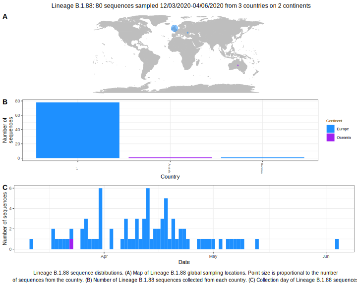

<ul class="actions small">
	 <a href="{{ 'lineages/lineage_B.1.html' | absolute_url }}" class="button special fit">Go to parent lineage: B.1</a>
</ul>

<h3> Lineage summaries</h3>

| Lineage name | Most common countries | Date range | Number of taxa |  Days since last sampling | Known Travel | Recall value |
|:-----|:-----|:-------|-------:|-------:|:---------|--------:|
| <a href="{{ 'lineages/lineage_B.1.88.html' | absolute_url }}">B.1.88</a> | UK (95%), Australia (2%), Romania (2%) | March 12 to June 04 | 42 | 18 |  | 1.000 |

<h3>Lineage descriptions</h3>

| Lineage | Notes |
|:-----|:-----|
| <a href="{{ 'lineages/lineage_B.1.88.html' | absolute_url }}">B.1.88</a> | UK lineage, previously some of these seqeunces had been assigned B.1.11, but this clade has split in the tree. Now reassigned a new lineage. |

