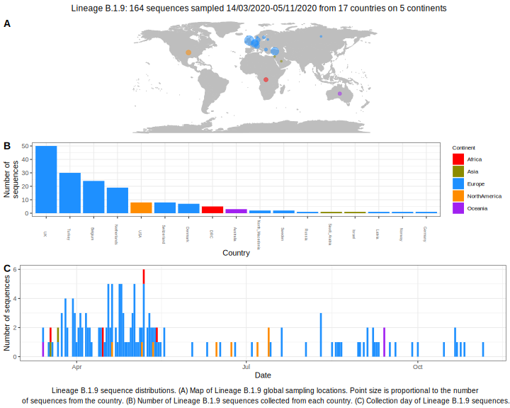

<ul class="actions small">
	 <a href="{{ 'lineages/lineage_B.1.html' | absolute_url }}" class="button special fit">Go to parent lineage: B.1</a>
</ul>

<h3> Lineage summaries</h3>

| Lineage name | Most common countries | Date range | Number of taxa | Known Travel | Recall value |
|:-----|:-----|:-------|-------:|-------:|:---------|--------:|
| <a href="{{ 'lineages/lineage_B.1.9.html' | absolute_url }}">B.1.9</a> | UK (31%), Turkey (25%), Belgium (20%) | March 14 to July 14 | 121 | Saudia_Arabia to Turkey (1) | 0.97 |

<h3>Lineage descriptions</h3>

| Lineage | Notes |
|:-----|:-----|
| <a href="{{ 'lineages/lineage_B.1.9.html' | absolute_url }}">B.1.9</a> | Netherlands/ Belgium/ Turkey/ DRC  |

