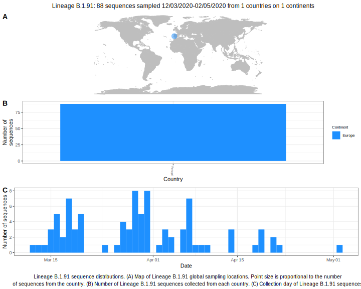

<ul class="actions small">
	 <a href="{{ 'lineages/lineage_B.1.html' | absolute_url }}" class="button special fit">Go to parent lineage: B.1</a>
</ul>

<h3> Lineage summaries</h3>

| Lineage name | Most common countries | Date range | Number of taxa |  Days since last sampling | Known Travel | Recall value |
|:-----|:-----|:-------|-------:|-------:|:---------|--------:|
| <a href="{{ 'lineages/lineage_B.1.91.html' | absolute_url }}">B.1.91</a> | Portugal (100%) | March 14 to May 02 | 79 |  | 0.97 |

<h3>Lineage descriptions</h3>

| Lineage | Notes |
|:-----|:-----|
| <a href="{{ 'lineages/lineage_B.1.91.html' | absolute_url }}">B.1.91</a> | Portuguese lineage, parent node in B.1 also has Portuguese diversity, however is interspersed with sequences from UK and other European countries |

