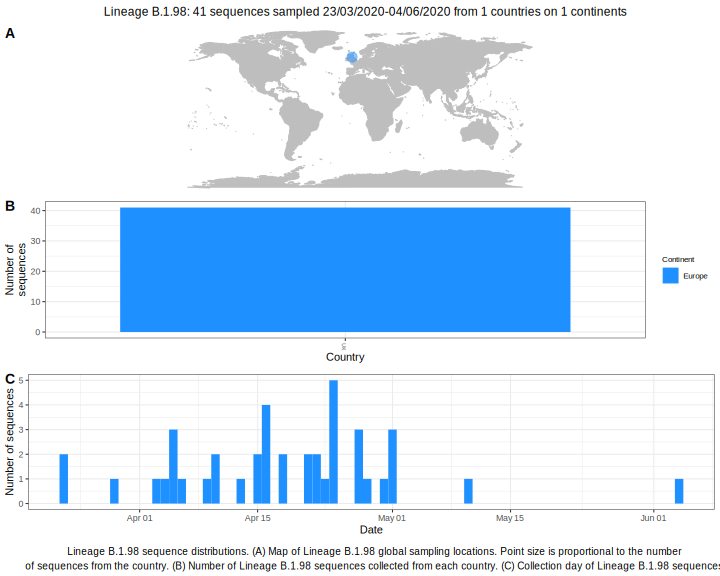

<ul class="actions small">
	 <a href="{{ 'lineages/lineage_B.1.html' | absolute_url }}" class="button special fit">Go to parent lineage: B.1</a>
</ul>

<h3> Lineage summaries</h3>

| Lineage name | Most common countries | Date range | Number of taxa | Known Travel | Recall value |
|:-----|:-----|:-------|-------:|-------:|:---------|--------:|
| <a href="{{ 'lineages/lineage_B.1.98.html' | absolute_url }}">B.1.98</a> | UK (92%), USA (5%), Australia (1%) | February 03 to July 17 | 551 | UK to Iceland (1) | 0.98 |

<h3>Lineage descriptions</h3>

| Lineage | Notes |
|:-----|:-----|
| <a href="{{ 'lineages/lineage_B.1.98.html' | absolute_url }}">B.1.98</a> | UK lineage with some USA and Australian sequences in |

