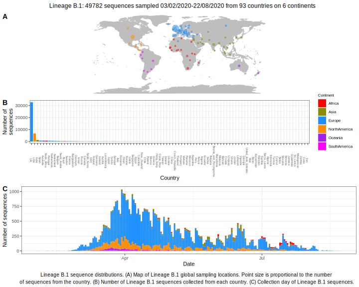

<ul class="actions small">
	 <a href="{{ 'lineages/lineage_B.html' | absolute_url }}" class="button special fit">Go to parent lineage: B</a>
</ul>

<h3> Lineage summaries</h3>

| Lineage name | Most common countries | Date range | Number of taxa |  Days since last sampling | Known Travel | Recall value |
|:-----|:-----|:-------|-------:|-------:|:---------|--------:|
| <a href="{{ 'lineages/lineage_B.1.html' | absolute_url }}">B.1</a> | USA (33%), UK (33%), Australia (5%) | February 03 to June 21 | 12883 | 1 | United_Arab_Emirates to Taiwan (1), UK to South_Africa, China, Iceland (17), Iran to Lebanon, Finland, Turkey (3), Spain to Iceland (6), Austria to China, Taiwan, Iceland (43), Italy to Czech_Republic, Brazil, China, Finland, Iceland, Belgium (20), France to Taiwan, Iceland, Turkey (4), Switzerland to Iceland (5), Germany to Iceland (2), Netherlands to South_Africa, Iceland (4), USA to China, Taiwan, Iceland, Costa_Rica (7), Egypt to Lebanon, Taiwan (4), Czech_Republic;USA to Taiwan (1), Czech_Republic to Taiwan (1), Poland to Taiwan (1), Canada to China (1), Argentina to Mexico (1) | 0.962 |
| <a href="{{ 'lineages/lineage_B.1.1.html' | absolute_url }}">B.1.1</a> | UK (71%), USA (3%), Portugal (2%) | February 23 to June 14 | 9635 | 8 | Italy to Chile, Brazil, Thailand, New_Zealand, Nigeria, Iceland, Mexico (37), Finland to Iceland (1), Spain to Czech_Republic, Taiwan, Iceland (4), Austria;Spain;Germany;Italy to Brazil (1), Austria to Iceland (4), Mexico to Argentina (1), Switzerland to Iceland (1), Saudia_Arabia to Turkey (1), France to Argentina (1), UK to Lebanon, China, Iceland, Kuwait (8), Germany to Iceland (1), USA to Taiwan, Brazil (3), Hungary to China (3), Maldives to Germany (1) | 0.984 |
| <a href="{{ 'lineages/lineage_B.1.1.1.html' | absolute_url }}">B.1.1.1</a> | UK (92%), Belgium (1%), Netherlands (1%) | March 02 to June 13 | 1726 | 9 | Austria to Iceland (5), UK to Argentina, Iceland (3), Peru;Argentina to Costa_Rica (1) | 0.998 |
| <a href="{{ 'lineages/lineage_B.1.1.10.html' | absolute_url }}">B.1.1.10</a> | UK (83%), Netherlands (8%), USA (4%) | March 08 to May 22 | 221 | 31 | USA to Iceland (1) | 0.864 |
| <a href="{{ 'lineages/lineage_B.1.1.12.html' | absolute_url }}">B.1.1.12</a> | UK (100%) | March 21 to April 22 | 19 | 61 |  | 1.000 |
| <a href="{{ 'lineages/lineage_B.1.1.13.html' | absolute_url }}">B.1.1.13</a> | UK (100%) | March 28 to April 15 | 16 | 68 |  | 1.000 |
| <a href="{{ 'lineages/lineage_B.1.1.14.html' | absolute_url }}">B.1.1.14</a> | UK (100%) | April 16 to June 02 | 39 | 20 |  | 1.000 |
| <a href="{{ 'lineages/lineage_B.1.1.15.html' | absolute_url }}">B.1.1.15</a> | Luxembourg (41%), UK (38%), Portugal (21%) | March 09 to April 28 | 29 | 55 |  | 0.000 |
| <a href="{{ 'lineages/lineage_B.1.1.16.html' | absolute_url }}">B.1.1.16</a> | UK (100%) | April 03 to May 29 | 34 | 24 |  | 1.000 |
| <a href="{{ 'lineages/lineage_B.1.1.17.html' | absolute_url }}">B.1.1.17</a> | Iceland (100%) | March 06 to March 28 | 29 | 86 | Italy to Iceland (1) | 1.000 |
| <a href="{{ 'lineages/lineage_B.1.1.19.html' | absolute_url }}">B.1.1.19</a> | Australia (100%) | March 23 to March 26 | 6 | 88 |  | 0.000 |
| <a href="{{ 'lineages/lineage_B.1.1.2.html' | absolute_url }}">B.1.1.2</a> | UK (100%) | March 20 to June 03 | 288 | 19 |  | 1.000 |
| <a href="{{ 'lineages/lineage_B.1.1.20.html' | absolute_url }}">B.1.1.20</a> | UK (100%) | March 21 to May 06 | 11 | 47 |  | 1.000 |
| <a href="{{ 'lineages/lineage_B.1.1.21.html' | absolute_url }}">B.1.1.21</a> | Australia (100%) | April 07 to April 17 | 13 | 66 |  | 0.000 |
| <a href="{{ 'lineages/lineage_B.1.1.23.html' | absolute_url }}">B.1.1.23</a> | Bangladesh (92%), Australia (8%) | April 17 to June 02 | 13 | 20 |  | 1.000 |
| <a href="{{ 'lineages/lineage_B.1.1.24.html' | absolute_url }}">B.1.1.24</a> | Portugal (100%) | April 17 to April 24 | 18 | 59 |  | 1.000 |
| <a href="{{ 'lineages/lineage_B.1.1.25.html' | absolute_url }}">B.1.1.25</a> | Bangladesh (73%), Australia (27%) | April 08 to June 01 | 41 | 21 |  | 0.846 |
| <a href="{{ 'lineages/lineage_B.1.1.26.html' | absolute_url }}">B.1.1.26</a> | USA (100%) | April 02 to May 06 | 45 | 47 |  | 1.000 |
| <a href="{{ 'lineages/lineage_B.1.1.27.html' | absolute_url }}">B.1.1.27</a> | Oman (100%) | March 21 to May 09 | 13 | 44 |  | 1.000 |
| <a href="{{ 'lineages/lineage_B.1.1.28.html' | absolute_url }}">B.1.1.28</a> | Brazil (85%), UK (7%), China (4%) | March 05 to May 08 | 54 | 45 | Italy to Brazil (1) | 0.909 |
| <a href="{{ 'lineages/lineage_B.1.1.29.html' | absolute_url }}">B.1.1.29</a> | UK (100%) | April 08 to May 30 | 57 | 23 |  | 1.000 |
| <a href="{{ 'lineages/lineage_B.1.1.3.html' | absolute_url }}">B.1.1.3</a> | UK (100%) | March 18 to June 03 | 84 | 19 |  | 1.000 |
| <a href="{{ 'lineages/lineage_B.1.1.30.html' | absolute_url }}">B.1.1.30</a> | UK (100%) | March 30 to June 04 | 93 | 18 |  | 0.955 |
| <a href="{{ 'lineages/lineage_B.1.1.31.html' | absolute_url }}">B.1.1.31</a> | Netherlands (96%), Canada (4%) | March 26 to May 26 | 23 | 27 |  | 1.000 |
| <a href="{{ 'lineages/lineage_B.1.1.32.html' | absolute_url }}">B.1.1.32</a> | India (100%) | April 04 to June 02 | 52 | 20 |  | 1.000 |
| <a href="{{ 'lineages/lineage_B.1.1.33.html' | absolute_url }}">B.1.1.33</a> | Brazil (77%), USA (9%), Chile (5%) | March 01 to April 28 | 172 | 55 |  | 1.000 |
| <a href="{{ 'lineages/lineage_B.1.1.4.html' | absolute_url }}">B.1.1.4</a> | UK (100%) | March 26 to May 22 | 53 | 31 |  | 1.000 |
| <a href="{{ 'lineages/lineage_B.1.1.5.html' | absolute_url }}">B.1.1.5</a> | UK (50%), Belgium (33%), Iceland (12%) | March 16 to May 14 | 42 | 39 |  | 1.000 |
| <a href="{{ 'lineages/lineage_B.1.1.6.html' | absolute_url }}">B.1.1.6</a> | Austria (100%) | February 26 to March 25 | 43 | 89 |  | 0.929 |
| <a href="{{ 'lineages/lineage_B.1.1.7.html' | absolute_url }}">B.1.1.7</a> | UK (91%), Australia (3%), Iceland (3%) | March 07 to May 27 | 111 | 26 | USA to Iceland (1) | 1.000 |
| <a href="{{ 'lineages/lineage_B.1.1.8.html' | absolute_url }}">B.1.1.8</a> | India (100%) | May 11 to June 02 | 39 | 20 |  | 1.000 |
| <a href="{{ 'lineages/lineage_B.1.100.html' | absolute_url }}">B.1.100</a> | UK (100%) | April 13 to May 19 | 20 | 34 |  | 1.000 |
| <a href="{{ 'lineages/lineage_B.1.101.html' | absolute_url }}">B.1.101</a> | UK (100%) | March 22 to June 01 | 41 | 21 |  | 1.000 |
| <a href="{{ 'lineages/lineage_B.1.102.html' | absolute_url }}">B.1.102</a> | Iceland (98%), Spain (2%) | March 12 to March 28 | 95 | 86 | Argentina to Iceland (1) | 1.000 |
| <a href="{{ 'lineages/lineage_B.1.103.html' | absolute_url }}">B.1.103</a> | USA (97%), Spain (3%) | March 21 to May 19 | 37 | 34 |  | 1.000 |
| <a href="{{ 'lineages/lineage_B.1.104.html' | absolute_url }}">B.1.104</a> | UK (89%), USA (7%), Singapore (3%) | March 02 to May 05 | 149 | 48 |  | 1.000 |
| <a href="{{ 'lineages/lineage_B.1.105.html' | absolute_url }}">B.1.105</a> | UK (100%) | March 21 to May 31 | 88 | 22 |  | 1.000 |
| <a href="{{ 'lineages/lineage_B.1.106.html' | absolute_url }}">B.1.106</a> | South_Africa (98%), UK (2%) | March 28 to June 04 | 47 | 18 |  | 0.900 |
| <a href="{{ 'lineages/lineage_B.1.107.html' | absolute_url }}">B.1.107</a> | Denmark (100%) | March 18 to April 28 | 58 | 55 |  | 0.923 |
| <a href="{{ 'lineages/lineage_B.1.108.html' | absolute_url }}">B.1.108</a> | USA (100%) | March 14 to April 27 | 34 | 56 |  | 1.000 |
| <a href="{{ 'lineages/lineage_B.1.109.html' | absolute_url }}">B.1.109</a> | Luxembourg (100%) | April 12 to May 19 | 12 | 34 |  | 1.000 |
| <a href="{{ 'lineages/lineage_B.1.11.html' | absolute_url }}">B.1.11</a> | UK (97%), Australia (1%), Iceland (0%) | March 07 to June 16 | 664 | 6 | France to Iceland (1), UK to Iceland (1), Austria to Iceland (1) | 0.974 |
| <a href="{{ 'lineages/lineage_B.1.110.html' | absolute_url }}">B.1.110</a> | Chile (51%), USA (46%), Australia (4%) | March 02 to May 08 | 57 | 45 |  | 1.000 |
| <a href="{{ 'lineages/lineage_B.1.111.html' | absolute_url }}">B.1.111</a> | Colombia (48%), UK (38%), USA (7%) | March 07 to May 06 | 29 | 47 |  | 1.000 |
| <a href="{{ 'lineages/lineage_B.1.112.html' | absolute_url }}">B.1.112</a> | USA (100%) | April 07 to April 21 | 48 | 62 |  | 1.000 |
| <a href="{{ 'lineages/lineage_B.1.113.html' | absolute_url }}">B.1.113</a> | India (78%), Saudi_Arabia (7%), Turkey (6%) | March 15 to June 08 | 111 | 14 | Saudia_Arabia to Turkey (3), Iran to Turkey (1) | 1.000 |
| <a href="{{ 'lineages/lineage_B.1.114.html' | absolute_url }}">B.1.114</a> | Canada (96%), USA (4%) | March 08 to April 25 | 26 | 58 |  | 1.000 |
| <a href="{{ 'lineages/lineage_B.1.115.html' | absolute_url }}">B.1.115</a> | Israel (93%), ISRAEL (7%) | March 17 to April 11 | 14 | 72 |  | 1.000 |
| <a href="{{ 'lineages/lineage_B.1.116.html' | absolute_url }}">B.1.116</a> | USA (100%) | May 01 to May 21 | 57 | 32 |  | 1.000 |
| <a href="{{ 'lineages/lineage_B.1.117.html' | absolute_url }}">B.1.117</a> | UK (100%) | March 30 to May 15 | 56 | 38 |  | 1.000 |
| <a href="{{ 'lineages/lineage_B.1.118.html' | absolute_url }}">B.1.118</a> | Denmark (100%) | March 19 to April 14 | 21 | 69 |  | 1.000 |
| <a href="{{ 'lineages/lineage_B.1.119.html' | absolute_url }}">B.1.119</a> | USA (100%) | April 27 to May 20 | 33 | 33 |  | 1.000 |
| <a href="{{ 'lineages/lineage_B.1.12.html' | absolute_url }}">B.1.12</a> | Luxembourg (44%), Belgium (41%), UK (13%) | March 04 to June 01 | 61 | 21 |  | 0.933 |
| <a href="{{ 'lineages/lineage_B.1.120.html' | absolute_url }}">B.1.120</a> | UK (100%) | April 14 to June 11 | 103 | 11 |  | 1.000 |
| <a href="{{ 'lineages/lineage_B.1.121.html' | absolute_url }}">B.1.121</a> | Australia (100%) | April 09 to May 26 | 69 | 27 |  | 1.000 |
| <a href="{{ 'lineages/lineage_B.1.122.html' | absolute_url }}">B.1.122</a> | UK (100%) | April 02 to May 20 | 19 | 33 |  | 1.000 |
| <a href="{{ 'lineages/lineage_B.1.123.html' | absolute_url }}">B.1.123</a> | USA (100%) | March 16 to April 27 | 23 | 56 |  | 1.000 |
| <a href="{{ 'lineages/lineage_B.1.124.html' | absolute_url }}">B.1.124</a> | USA (100%) | March 26 to May 07 | 69 | 46 |  | 1.000 |
| <a href="{{ 'lineages/lineage_B.1.125.html' | absolute_url }}">B.1.125</a> | South_Africa (100%) | March 29 to April 09 | 23 | 74 |  | 1.000 |
| <a href="{{ 'lineages/lineage_B.1.13.html' | absolute_url }}">B.1.13</a> | UK (94%), Australia (4%), Poland (0%) | March 09 to May 15 | 286 | 38 |  | 0.987 |
| <a href="{{ 'lineages/lineage_B.1.19.html' | absolute_url }}">B.1.19</a> | USA (100%) | March 19 to April 17 | 30 | 66 |  | 1.000 |
| <a href="{{ 'lineages/lineage_B.1.2.html' | absolute_url }}">B.1.2</a> | USA (96%), Australia (2%), Canada (1%) | March 08 to June 08 | 785 | 14 |  | 0.971 |
| <a href="{{ 'lineages/lineage_B.1.21.html' | absolute_url }}">B.1.21</a> | USA (99%), Iceland (0%), Denmark (0%) | March 08 to May 30 | 391 | 23 |  | 0.963 |
| <a href="{{ 'lineages/lineage_B.1.22.html' | absolute_url }}">B.1.22</a> | Netherlands (90%), Australia (4%), Belgium (1%) | March 09 to May 22 | 236 | 31 |  | 1.000 |
| <a href="{{ 'lineages/lineage_B.1.23.html' | absolute_url }}">B.1.23</a> | Australia (95%), New_Zealand (4%), Portugal (1%) | March 18 to April 30 | 104 | 53 |  | 1.000 |
| <a href="{{ 'lineages/lineage_B.1.25.html' | absolute_url }}">B.1.25</a> | Australia (100%) | March 19 to March 25 | 15 | 89 |  | 0.000 |
| <a href="{{ 'lineages/lineage_B.1.26.html' | absolute_url }}">B.1.26</a> | USA (50%), New_Zealand (49%), Australia (1%) | March 15 to June 13 | 103 | 9 |  | 1.000 |
| <a href="{{ 'lineages/lineage_B.1.29.html' | absolute_url }}">B.1.29</a> | USA (97%), Australia (3%) | March 15 to June 12 | 35 | 10 |  | 1.000 |
| <a href="{{ 'lineages/lineage_B.1.3.html' | absolute_url }}">B.1.3</a> | USA (83%), Israel (8%), ISRAEL (4%) | March 05 to May 17 | 374 | 36 |  | 1.000 |
| <a href="{{ 'lineages/lineage_B.1.30.html' | absolute_url }}">B.1.30</a> | UK (100%) | March 17 to May 04 | 65 | 49 |  | 0.941 |
| <a href="{{ 'lineages/lineage_B.1.31.html' | absolute_url }}">B.1.31</a> | Australia (100%) | March 21 to April 04 | 15 | 79 |  | 1.000 |
| <a href="{{ 'lineages/lineage_B.1.32.html' | absolute_url }}">B.1.32</a> | Sweden (100%) | March 04 to March 10 | 18 | 104 |  | 1.000 |
| <a href="{{ 'lineages/lineage_B.1.34.html' | absolute_url }}">B.1.34</a> | UK (100%) | March 17 to April 26 | 20 | 57 |  | 1.000 |
| <a href="{{ 'lineages/lineage_B.1.35.html' | absolute_url }}">B.1.35</a> | UK (99%), USA (1%) | March 07 to June 06 | 166 | 16 |  | 0.944 |
| <a href="{{ 'lineages/lineage_B.1.36.html' | absolute_url }}">B.1.36</a> | UK (32%), India (29%), Saudi_Arabia (23%) | March 10 to June 15 | 296 | 7 | Saudia_Arabia to Turkey (3) | 0.975 |
| <a href="{{ 'lineages/lineage_B.1.37.html' | absolute_url }}">B.1.37</a> | USA (100%) | March 10 to May 12 | 37 | 41 |  | 1.000 |
| <a href="{{ 'lineages/lineage_B.1.38.html' | absolute_url }}">B.1.38</a> | USA (100%) | March 17 to April 27 | 20 | 56 |  | 1.000 |
| <a href="{{ 'lineages/lineage_B.1.39.html' | absolute_url }}">B.1.39</a> | Denmark (90%), UK (6%), Australia (1%) | March 13 to April 28 | 69 | 55 |  | 0.938 |
| <a href="{{ 'lineages/lineage_B.1.40.html' | absolute_url }}">B.1.40</a> | UK (100%) | March 18 to May 23 | 31 | 30 |  | 1.000 |
| <a href="{{ 'lineages/lineage_B.1.41.html' | absolute_url }}">B.1.41</a> | USA (100%) | March 19 to April 15 | 41 | 68 |  | 1.000 |
| <a href="{{ 'lineages/lineage_B.1.42.html' | absolute_url }}">B.1.42</a> | Denmark (90%), Sweden (5%), Iceland (4%) | March 03 to April 28 | 127 | 55 | Faroe_Islands to Iceland (1), UK to Iceland (1), Denmark to Iceland (2) | 0.931 |
| <a href="{{ 'lineages/lineage_B.1.43.html' | absolute_url }}">B.1.43</a> | USA (99%), Australia (1%) | March 07 to June 07 | 158 | 15 |  | 0.979 |
| <a href="{{ 'lineages/lineage_B.1.44.html' | absolute_url }}">B.1.44</a> | UK (100%) | March 25 to June 02 | 97 | 20 |  | 1.000 |
| <a href="{{ 'lineages/lineage_B.1.5.html' | absolute_url }}">B.1.5</a> | UK (39%), Spain (37%), USA (3%) | January 24 to June 22 | 1731 | 0 | Spain to Argentina, China, Iceland (3), Israel to Argentina (1), Brazil to Argentina (1), Saudia_Arabia to Turkey (2), Croatia to Iceland (1), Portugal to Taiwan (1) | 0.953 |
| <a href="{{ 'lineages/lineage_B.1.5.10.html' | absolute_url }}">B.1.5.10</a> | UK (100%) | March 21 to June 03 | 50 | 19 |  | 1.000 |
| <a href="{{ 'lineages/lineage_B.1.5.2.html' | absolute_url }}">B.1.5.2</a> | Netherlands (96%), UK (3%), Belgium (1%) | March 14 to April 21 | 77 | 62 |  | 1.000 |
| <a href="{{ 'lineages/lineage_B.1.5.3.html' | absolute_url }}">B.1.5.3</a> | UK (91%), Australia (3%), Sweden (3%) | March 18 to April 16 | 33 | 67 | Belgium;United_Kingdom to Taiwan (1) | 1.000 |
| <a href="{{ 'lineages/lineage_B.1.5.5.html' | absolute_url }}">B.1.5.5</a> | UK (100%) | April 08 to June 02 | 73 | 20 |  | 1.000 |
| <a href="{{ 'lineages/lineage_B.1.5.6.html' | absolute_url }}">B.1.5.6</a> | UK (100%) | March 19 to May 05 | 39 | 48 |  | 1.000 |
| <a href="{{ 'lineages/lineage_B.1.5.8.html' | absolute_url }}">B.1.5.8</a> | USA (94%), Denmark (3%), Belgium (3%) | March 13 to April 09 | 31 | 74 |  | 1.000 |
| <a href="{{ 'lineages/lineage_B.1.5.9.html' | absolute_url }}">B.1.5.9</a> | UK (100%), Sweden (0%) | March 12 to June 09 | 249 | 13 |  | 1.000 |
| <a href="{{ 'lineages/lineage_B.1.6.html' | absolute_url }}">B.1.6</a> | Belgium (79%), DRC (12%), UK (6%) | March 11 to April 18 | 34 | 65 |  | 1.000 |
| <a href="{{ 'lineages/lineage_B.1.66.html' | absolute_url }}">B.1.66</a> | UK (100%) | March 29 to May 20 | 31 | 33 |  | 1.000 |
| <a href="{{ 'lineages/lineage_B.1.67.html' | absolute_url }}">B.1.67</a> | UK (94%), Ecuador (6%) | March 25 to April 17 | 17 | 66 |  | 1.000 |
| <a href="{{ 'lineages/lineage_B.1.68.html' | absolute_url }}">B.1.68</a> | USA (100%) | March 19 to April 22 | 60 | 61 |  | 1.000 |
| <a href="{{ 'lineages/lineage_B.1.69.html' | absolute_url }}">B.1.69</a> | UK (100%) | March 06 to March 30 | 18 | 84 |  | 1.000 |
| <a href="{{ 'lineages/lineage_B.1.70.html' | absolute_url }}">B.1.70</a> | UK (100%) | March 13 to April 24 | 28 | 59 |  | 1.000 |
| <a href="{{ 'lineages/lineage_B.1.71.html' | absolute_url }}">B.1.71</a> | UK (100%) | March 18 to May 23 | 29 | 30 |  | 1.000 |
| <a href="{{ 'lineages/lineage_B.1.72.html' | absolute_url }}">B.1.72</a> | UK (100%) | March 16 to April 24 | 41 | 59 |  | 1.000 |
| <a href="{{ 'lineages/lineage_B.1.74.html' | absolute_url }}">B.1.74</a> | Spain (80%), Portugal (15%), Chile (3%) | March 01 to March 31 | 60 | 83 |  | 1.000 |
| <a href="{{ 'lineages/lineage_B.1.75.html' | absolute_url }}">B.1.75</a> | UK (98%), Mexico (1%), Luxembourg (1%) | March 06 to May 13 | 140 | 40 |  | 1.000 |
| <a href="{{ 'lineages/lineage_B.1.76.html' | absolute_url }}">B.1.76</a> | UK (100%) | February 24 to June 04 | 60 | 18 |  | 1.000 |
| <a href="{{ 'lineages/lineage_B.1.77.html' | absolute_url }}">B.1.77</a> | UK (100%) | March 20 to May 31 | 101 | 22 |  | 0.957 |
| <a href="{{ 'lineages/lineage_B.1.78.html' | absolute_url }}">B.1.78</a> | Netherlands (98%), UK (2%) | March 16 to May 19 | 48 | 34 |  | 1.000 |
| <a href="{{ 'lineages/lineage_B.1.79.html' | absolute_url }}">B.1.79</a> | UK (97%), India (1%), Cyprus (1%) | March 28 to June 03 | 78 | 19 |  | 1.000 |
| <a href="{{ 'lineages/lineage_B.1.8.html' | absolute_url }}">B.1.8</a> | Netherlands (71%), Iceland (6%), Denmark (3%) | March 04 to May 26 | 157 | 27 | Austria to Iceland (10) | 0.909 |
| <a href="{{ 'lineages/lineage_B.1.8.1.html' | absolute_url }}">B.1.8.1</a> | South_Africa (100%) | April 08 to April 09 | 14 | 74 |  | 1.000 |
| <a href="{{ 'lineages/lineage_B.1.80.html' | absolute_url }}">B.1.80</a> | India (91%), Luxembourg (4%), Australia (4%) | March 21 to June 05 | 56 | 17 |  | 0.938 |
| <a href="{{ 'lineages/lineage_B.1.81.html' | absolute_url }}">B.1.81</a> | UK (100%) | March 18 to May 07 | 19 | 46 |  | 1.000 |
| <a href="{{ 'lineages/lineage_B.1.82.html' | absolute_url }}">B.1.82</a> | UK (100%) | May 25 to June 15 | 21 | 7 |  | 1.000 |
| <a href="{{ 'lineages/lineage_B.1.83.html' | absolute_url }}">B.1.83</a> | Belgium (97%), USA (3%) | March 23 to April 09 | 30 | 74 |  | 1.000 |
| <a href="{{ 'lineages/lineage_B.1.84.html' | absolute_url }}">B.1.84</a> | DRC (95%), Spain (5%) | March 17 to May 22 | 20 | 31 |  | 1.000 |
| <a href="{{ 'lineages/lineage_B.1.85.html' | absolute_url }}">B.1.85</a> | USA (100%) | April 13 to April 22 | 12 | 61 |  | 1.000 |
| <a href="{{ 'lineages/lineage_B.1.86.html' | absolute_url }}">B.1.86</a> | UK (100%) | March 24 to June 02 | 21 | 20 |  | 1.000 |
| <a href="{{ 'lineages/lineage_B.1.87.html' | absolute_url }}">B.1.87</a> | India (75%), China (25%) | March 12 to April 20 | 8 | 63 | Spain to China (1), Norway to China (1) | 1.000 |
| <a href="{{ 'lineages/lineage_B.1.88.html' | absolute_url }}">B.1.88</a> | UK (95%), Australia (2%), Romania (2%) | March 12 to June 04 | 42 | 18 |  | 1.000 |
| <a href="{{ 'lineages/lineage_B.1.89.html' | absolute_url }}">B.1.89</a> | UK (100%) | March 22 to May 21 | 74 | 32 |  | 0.900 |
| <a href="{{ 'lineages/lineage_B.1.9.html' | absolute_url }}">B.1.9</a> | Belgium (31%), Netherlands (30%), UK (24%) | March 14 to May 14 | 108 | 39 | Saudia_Arabia to Turkey (1) | 1.000 |
| <a href="{{ 'lineages/lineage_B.1.90.html' | absolute_url }}">B.1.90</a> | UK (100%) | March 23 to May 16 | 31 | 37 |  | 1.000 |
| <a href="{{ 'lineages/lineage_B.1.91.html' | absolute_url }}">B.1.91</a> | Portugal (100%) | March 12 to May 02 | 88 | 51 |  | 1.000 |
| <a href="{{ 'lineages/lineage_B.1.93.html' | absolute_url }}">B.1.93</a> | UK (100%) | March 19 to June 03 | 521 | 19 |  | 1.000 |
| <a href="{{ 'lineages/lineage_B.1.94.html' | absolute_url }}">B.1.94</a> | Luxembourg (94%), Switzerland (6%) | March 15 to April 24 | 18 | 59 |  | 1.000 |
| <a href="{{ 'lineages/lineage_B.1.95.html' | absolute_url }}">B.1.95</a> | India (100%) | April 20 to May 14 | 6 | 39 |  | 0.000 |
| <a href="{{ 'lineages/lineage_B.1.96.html' | absolute_url }}">B.1.96</a> | Netherlands (95%), USA (2%), Norway (2%) | March 14 to May 11 | 41 | 42 |  | 1.000 |
| <a href="{{ 'lineages/lineage_B.1.97.html' | absolute_url }}">B.1.97</a> | UK (100%) | March 24 to May 05 | 35 | 48 |  | 1.000 |
| <a href="{{ 'lineages/lineage_B.1.98.html' | absolute_url }}">B.1.98</a> | UK (100%) | March 12 to May 10 | 45 | 43 |  | 1.000 |
| <a href="{{ 'lineages/lineage_B.1.99.html' | absolute_url }}">B.1.99</a> | UK (100%) | March 21 to May 11 | 44 | 42 |  | 1.000 |

<h3>Lineage descriptions</h3>

| Lineage | Notes |
|:-----|:-----|
| <a href="{{ 'lineages/lineage_B.1.html' | absolute_url }}">B.1</a> | A large European lineage that corresponds to the Italian outbreak. |
| <a href="{{ 'lineages/lineage_B.1.1.html' | absolute_url }}">B.1.1</a> | European lineage that's been assigned due to high support and 3 clear SNPs `28881GA`,`28882GA`,`28883GC` |
| <a href="{{ 'lineages/lineage_B.1.1.1.html' | absolute_url }}">B.1.1.1</a> | UK/ Europe (BS=13) |
| <a href="{{ 'lineages/lineage_B.1.1.10.html' | absolute_url }}">B.1.1.10</a> | FormerlyUK/ Iceland (BS=13), a lot of diversity in this lineage, now has a Turkish sequence.  |
| <a href="{{ 'lineages/lineage_B.1.1.12.html' | absolute_url }}">B.1.1.12</a> | Scottish lineage (BS=14) |
| <a href="{{ 'lineages/lineage_B.1.1.13.html' | absolute_url }}">B.1.1.13</a> | UK lineage (BS=73) |
| <a href="{{ 'lineages/lineage_B.1.1.14.html' | absolute_url }}">B.1.1.14</a> | Scottish lineage (BS=79) |
| <a href="{{ 'lineages/lineage_B.1.1.15.html' | absolute_url }}">B.1.1.15</a> | Luxembourg lineage (BS=16, but internal nodes all 100) |
| <a href="{{ 'lineages/lineage_B.1.1.16.html' | absolute_url }}">B.1.1.16</a> | Wales lineage (BS=96) |
| <a href="{{ 'lineages/lineage_B.1.1.17.html' | absolute_url }}">B.1.1.17</a> | Iceland lineage (BS=100) |
| <a href="{{ 'lineages/lineage_B.1.1.19.html' | absolute_url }}">B.1.1.19</a> | Australian lineage (BS=24) |
| <a href="{{ 'lineages/lineage_B.1.1.2.html' | absolute_url }}">B.1.1.2</a> | Welsh lineage (BS=59) |
| <a href="{{ 'lineages/lineage_B.1.1.20.html' | absolute_url }}">B.1.1.20</a> | Scottish lineage (BS=74) |
| <a href="{{ 'lineages/lineage_B.1.1.21.html' | absolute_url }}">B.1.1.21</a> | Australian lineage (BS=100) |
| <a href="{{ 'lineages/lineage_B.1.1.22.html' | absolute_url }}">B.1.1.22</a> | South African lineage (BS=35) |
| <a href="{{ 'lineages/lineage_B.1.1.23.html' | absolute_url }}">B.1.1.23</a> | Bangladesh lineage (BS=13) |
| <a href="{{ 'lineages/lineage_B.1.1.24.html' | absolute_url }}">B.1.1.24</a> | Portuguese lineage (BS=87) |
| <a href="{{ 'lineages/lineage_B.1.1.25.html' | absolute_url }}">B.1.1.25</a> | Bangladesh/Australian lineage (BS=13) |
| <a href="{{ 'lineages/lineage_B.1.1.26.html' | absolute_url }}">B.1.1.26</a> | US lineage (BS=79) |
| <a href="{{ 'lineages/lineage_B.1.1.27.html' | absolute_url }}">B.1.1.27</a> | Lineage in Oman (BS=100) |
| <a href="{{ 'lineages/lineage_B.1.1.28.html' | absolute_url }}">B.1.1.28</a> | Fujian/ Brazil lineage (BS=18, but distinct epi data) |
| <a href="{{ 'lineages/lineage_B.1.1.29.html' | absolute_url }}">B.1.1.29</a> | Wales lineage (BS=100) |
| <a href="{{ 'lineages/lineage_B.1.1.3.html' | absolute_url }}">B.1.1.3</a> | English lineage (BS=92) |
| <a href="{{ 'lineages/lineage_B.1.1.30.html' | absolute_url }}">B.1.1.30</a> | Wales lineage (BS=91) |
| <a href="{{ 'lineages/lineage_B.1.1.31.html' | absolute_url }}">B.1.1.31</a> | Netherlands lineage (BS=35) |
| <a href="{{ 'lineages/lineage_B.1.1.32.html' | absolute_url }}">B.1.1.32</a> | Indian lineage (BS=56) |
| <a href="{{ 'lineages/lineage_B.1.1.33.html' | absolute_url }}">B.1.1.33</a> | Majoritively South American lineage, lots of Brazil sequences represented (BS=71) |
| <a href="{{ 'lineages/lineage_B.1.1.4.html' | absolute_url }}">B.1.1.4</a> | UK lineage (BS=76) |
| <a href="{{ 'lineages/lineage_B.1.1.5.html' | absolute_url }}">B.1.1.5</a> | Iceland/ Belgium/ UK (BS=85) |
| <a href="{{ 'lineages/lineage_B.1.1.6.html' | absolute_url }}">B.1.1.6</a> | Austrian lineage (BS=13) |
| <a href="{{ 'lineages/lineage_B.1.1.7.html' | absolute_url }}">B.1.1.7</a> | UK/ Australia/ Iceland (BS=100) |
| <a href="{{ 'lineages/lineage_B.1.1.8.html' | absolute_url }}">B.1.1.8</a> | Formerly UK/ USA/ Australia lineage. With new data, now refined to just include the Indian sequences. Indian lineage (BS=62) |
| <a href="{{ 'lineages/lineage_B.1.1.9.html' | absolute_url }}">B.1.1.9</a> | Reassigned B.1.1, split into three this week, unstable lineage |
| <a href="{{ 'lineages/lineage_B.1.1.p11.html' | absolute_url }}">B.1.1.p11</a> | Reassigned B.1.1, previously Portugal/ Wales/ England/ Ecuador (BS=13 this week) |
| <a href="{{ 'lineages/lineage_B.1.100.html' | absolute_url }}">B.1.100</a> | Previously B.1.5.5, Scottish lineage |
| <a href="{{ 'lineages/lineage_B.1.101.html' | absolute_url }}">B.1.101</a> | Scottish lineage |
| <a href="{{ 'lineages/lineage_B.1.102.html' | absolute_url }}">B.1.102</a> | Icelandic lineage, previously assigned B.1.5.1 |
| <a href="{{ 'lineages/lineage_B.1.103.html' | absolute_url }}">B.1.103</a> | US lineage |
| <a href="{{ 'lineages/lineage_B.1.104.html' | absolute_url }}">B.1.104</a> | English lineage |
| <a href="{{ 'lineages/lineage_B.1.105.html' | absolute_url }}">B.1.105</a> | English lineage |
| <a href="{{ 'lineages/lineage_B.1.106.html' | absolute_url }}">B.1.106</a> | South African lineage |
| <a href="{{ 'lineages/lineage_B.1.107.html' | absolute_url }}">B.1.107</a> | Danish lineage |
| <a href="{{ 'lineages/lineage_B.1.108.html' | absolute_url }}">B.1.108</a> | US lineage |
| <a href="{{ 'lineages/lineage_B.1.109.html' | absolute_url }}">B.1.109</a> | Luxembourg lineage |
| <a href="{{ 'lineages/lineage_B.1.11.html' | absolute_url }}">B.1.11</a> | UK lineage but low support and splitting up, pruned down quite a lot, but may need to be removed next time (BS=31) |
| <a href="{{ 'lineages/lineage_B.1.110.html' | absolute_url }}">B.1.110</a> | Chilean/ US lineage |
| <a href="{{ 'lineages/lineage_B.1.111.html' | absolute_url }}">B.1.111</a> | South American lineage |
| <a href="{{ 'lineages/lineage_B.1.112.html' | absolute_url }}">B.1.112</a> | US lineage |
| <a href="{{ 'lineages/lineage_B.1.113.html' | absolute_url }}">B.1.113</a> | Indian lineage |
| <a href="{{ 'lineages/lineage_B.1.114.html' | absolute_url }}">B.1.114</a> | Canadian lineage |
| <a href="{{ 'lineages/lineage_B.1.115.html' | absolute_url }}">B.1.115</a> | Israel lineage |
| <a href="{{ 'lineages/lineage_B.1.116.html' | absolute_url }}">B.1.116</a> | US lineage |
| <a href="{{ 'lineages/lineage_B.1.117.html' | absolute_url }}">B.1.117</a> | UK lineage |
| <a href="{{ 'lineages/lineage_B.1.118.html' | absolute_url }}">B.1.118</a> | Danish lineage |
| <a href="{{ 'lineages/lineage_B.1.119.html' | absolute_url }}">B.1.119</a> | US lineage |
| <a href="{{ 'lineages/lineage_B.1.12.html' | absolute_url }}">B.1.12</a> | BeNeLux  |
| <a href="{{ 'lineages/lineage_B.1.120.html' | absolute_url }}">B.1.120</a> | Wales lineage |
| <a href="{{ 'lineages/lineage_B.1.121.html' | absolute_url }}">B.1.121</a> | Australian lineage |
| <a href="{{ 'lineages/lineage_B.1.122.html' | absolute_url }}">B.1.122</a> | Welsh lineage |
| <a href="{{ 'lineages/lineage_B.1.123.html' | absolute_url }}">B.1.123</a> | Washington lineage, previously part of B.1.21, but split off in this phylogeny |
| <a href="{{ 'lineages/lineage_B.1.124.html' | absolute_url }}">B.1.124</a> | USA lineage |
| <a href="{{ 'lineages/lineage_B.1.125.html' | absolute_url }}">B.1.125</a> | South African lineage |
| <a href="{{ 'lineages/lineage_B.1.13.html' | absolute_url }}">B.1.13</a> | UK lineage |
| <a href="{{ 'lineages/lineage_B.1.19.html' | absolute_url }}">B.1.19</a> | USA lineage |
| <a href="{{ 'lineages/lineage_B.1.2.html' | absolute_url }}">B.1.2</a> | USA lineage, split up a bit, refined it |
| <a href="{{ 'lineages/lineage_B.1.21.html' | absolute_url }}">B.1.21</a> | Washington (USA)  |
| <a href="{{ 'lineages/lineage_B.1.22.html' | absolute_url }}">B.1.22</a> | Netherlands lineage, now with some European sequences and some Australian sequences (BS=100) |
| <a href="{{ 'lineages/lineage_B.1.23.html' | absolute_url }}">B.1.23</a> | Australian lineage  |
| <a href="{{ 'lineages/lineage_B.1.25.html' | absolute_url }}">B.1.25</a> | Australian lineage |
| <a href="{{ 'lineages/lineage_B.1.26.html' | absolute_url }}">B.1.26</a> | New Zealand/ USA lineage  |
| <a href="{{ 'lineages/lineage_B.1.29.html' | absolute_url }}">B.1.29</a> | USA lineage |
| <a href="{{ 'lineages/lineage_B.1.3.html' | absolute_url }}">B.1.3</a> | USA lineage |
| <a href="{{ 'lineages/lineage_B.1.30.html' | absolute_url }}">B.1.30</a> | England lineage |
| <a href="{{ 'lineages/lineage_B.1.31.html' | absolute_url }}">B.1.31</a> | Australia lineage |
| <a href="{{ 'lineages/lineage_B.1.32.html' | absolute_url }}">B.1.32</a> | Swedish lineage  |
| <a href="{{ 'lineages/lineage_B.1.34.html' | absolute_url }}">B.1.34</a> | England lineage  |
| <a href="{{ 'lineages/lineage_B.1.35.html' | absolute_url }}">B.1.35</a> | UK lineage |
| <a href="{{ 'lineages/lineage_B.1.36.html' | absolute_url }}">B.1.36</a> | Global lineage- Turkey, Saudi Arabia, India, UK |
| <a href="{{ 'lineages/lineage_B.1.37.html' | absolute_url }}">B.1.37</a> | USA lineage  |
| <a href="{{ 'lineages/lineage_B.1.38.html' | absolute_url }}">B.1.38</a> | USA lineage |
| <a href="{{ 'lineages/lineage_B.1.39.html' | absolute_url }}">B.1.39</a> | Danish lineage |
| <a href="{{ 'lineages/lineage_B.1.40.html' | absolute_url }}">B.1.40</a> | Scottish lineage |
| <a href="{{ 'lineages/lineage_B.1.41.html' | absolute_url }}">B.1.41</a> | USA lineage  |
| <a href="{{ 'lineages/lineage_B.1.42.html' | absolute_url }}">B.1.42</a> | Sweden/ Denmark lineage |
| <a href="{{ 'lineages/lineage_B.1.43.html' | absolute_url }}">B.1.43</a> | USA lineage  |
| <a href="{{ 'lineages/lineage_B.1.44.html' | absolute_url }}">B.1.44</a> | Wales lineage |
| <a href="{{ 'lineages/lineage_B.1.5.html' | absolute_url }}">B.1.5</a> | European lineage/ lots of Spanish sequences towards the basal end of the subtree and exports around the globe. Low support at parent node now, potentially as a result of homoplasies  |
| <a href="{{ 'lineages/lineage_B.1.5.10.html' | absolute_url }}">B.1.5.10</a> | UK lineage |
| <a href="{{ 'lineages/lineage_B.1.5.2.html' | absolute_url }}">B.1.5.2</a> | Netherlands  |
| <a href="{{ 'lineages/lineage_B.1.5.3.html' | absolute_url }}">B.1.5.3</a> | English lineage (now containing an Australian & Swedish seqeuence) |
| <a href="{{ 'lineages/lineage_B.1.5.4.html' | absolute_url }}">B.1.5.4</a> | Reassigned to B.1.5 as B.1.5 now seems to be European/ Spanish, so B.1.5.4 not a new introduction |
| <a href="{{ 'lineages/lineage_B.1.5.5.html' | absolute_url }}">B.1.5.5</a> | English lineage |
| <a href="{{ 'lineages/lineage_B.1.5.6.html' | absolute_url }}">B.1.5.6</a> | Scottish lineage |
| <a href="{{ 'lineages/lineage_B.1.5.8.html' | absolute_url }}">B.1.5.8</a> | US lineage |
| <a href="{{ 'lineages/lineage_B.1.5.9.html' | absolute_url }}">B.1.5.9</a> | Welsh lineage  |
| <a href="{{ 'lineages/lineage_B.1.6.html' | absolute_url }}">B.1.6</a> | Belgian lineage  |
| <a href="{{ 'lineages/lineage_B.1.66.html' | absolute_url }}">B.1.66</a> | English lineage  |
| <a href="{{ 'lineages/lineage_B.1.67.html' | absolute_url }}">B.1.67</a> | Wales lineage  |
| <a href="{{ 'lineages/lineage_B.1.68.html' | absolute_url }}">B.1.68</a> | USA lineage (UT)  |
| <a href="{{ 'lineages/lineage_B.1.69.html' | absolute_url }}">B.1.69</a> | Scottish lineage  |
| <a href="{{ 'lineages/lineage_B.1.70.html' | absolute_url }}">B.1.70</a> | Scottish lineage |
| <a href="{{ 'lineages/lineage_B.1.71.html' | absolute_url }}">B.1.71</a> | UK lineage |
| <a href="{{ 'lineages/lineage_B.1.72.html' | absolute_url }}">B.1.72</a> | UK lineage (BRIS) |
| <a href="{{ 'lineages/lineage_B.1.74.html' | absolute_url }}">B.1.74</a> | Spanish lineage, with sequences from Portugal too. |
| <a href="{{ 'lineages/lineage_B.1.75.html' | absolute_url }}">B.1.75</a> | English lineage |
| <a href="{{ 'lineages/lineage_B.1.76.html' | absolute_url }}">B.1.76</a> | English lineage |
| <a href="{{ 'lineages/lineage_B.1.77.html' | absolute_url }}">B.1.77</a> | UK lineage |
| <a href="{{ 'lineages/lineage_B.1.78.html' | absolute_url }}">B.1.78</a> | Netherlands lineage |
| <a href="{{ 'lineages/lineage_B.1.79.html' | absolute_url }}">B.1.79</a> | English lineage |
| <a href="{{ 'lineages/lineage_B.1.8.html' | absolute_url }}">B.1.8</a> | Netherlands/ Europe |
| <a href="{{ 'lineages/lineage_B.1.8.1.html' | absolute_url }}">B.1.8.1</a> | South African lineage |
| <a href="{{ 'lineages/lineage_B.1.80.html' | absolute_url }}">B.1.80</a> | Indian lineage, with a couple of Luxembourg sequences |
| <a href="{{ 'lineages/lineage_B.1.81.html' | absolute_url }}">B.1.81</a> | English lineage |
| <a href="{{ 'lineages/lineage_B.1.82.html' | absolute_url }}">B.1.82</a> | English lineage |
| <a href="{{ 'lineages/lineage_B.1.83.html' | absolute_url }}">B.1.83</a> | Belgian lineage |
| <a href="{{ 'lineages/lineage_B.1.84.html' | absolute_url }}">B.1.84</a> | DRC lineage |
| <a href="{{ 'lineages/lineage_B.1.85.html' | absolute_url }}">B.1.85</a> | USA lineage |
| <a href="{{ 'lineages/lineage_B.1.86.html' | absolute_url }}">B.1.86</a> | English lineage |
| <a href="{{ 'lineages/lineage_B.1.87.html' | absolute_url }}">B.1.87</a> | Indian lineage, with some Chinese and South African sequences |
| <a href="{{ 'lineages/lineage_B.1.88.html' | absolute_url }}">B.1.88</a> | UK lineage, previously some of these seqeunces had been assigned B.1.11, but this clade has split in the tree. Now reassigned a new lineage. |
| <a href="{{ 'lineages/lineage_B.1.89.html' | absolute_url }}">B.1.89</a> | Scottish lineage |
| <a href="{{ 'lineages/lineage_B.1.9.html' | absolute_url }}">B.1.9</a> | Netherlands/ Belgium/ Turkey/ DRC  |
| <a href="{{ 'lineages/lineage_B.1.90.html' | absolute_url }}">B.1.90</a> | Scottish lineage, previously part of B.1.11, but now reassigned |
| <a href="{{ 'lineages/lineage_B.1.91.html' | absolute_url }}">B.1.91</a> | Portuguese lineage |
| <a href="{{ 'lineages/lineage_B.1.93.html' | absolute_url }}">B.1.93</a> | UK lineage, majoritively Scottish sequences |
| <a href="{{ 'lineages/lineage_B.1.94.html' | absolute_url }}">B.1.94</a> | Luxembourg lineage |
| <a href="{{ 'lineages/lineage_B.1.95.html' | absolute_url }}">B.1.95</a> | Indian lineage |
| <a href="{{ 'lineages/lineage_B.1.96.html' | absolute_url }}">B.1.96</a> | Netherlands lineage |
| <a href="{{ 'lineages/lineage_B.1.97.html' | absolute_url }}">B.1.97</a> | English lineage |
| <a href="{{ 'lineages/lineage_B.1.98.html' | absolute_url }}">B.1.98</a> | UK lineage |
| <a href="{{ 'lineages/lineage_B.1.99.html' | absolute_url }}">B.1.99</a> | Previously part of B.1.5, English lineage |
| <a href="{{ 'lineages/lineage_B.1.p16.html' | absolute_url }}">B.1.p16</a> | Belgium lineage, reassigned to B.1 |

