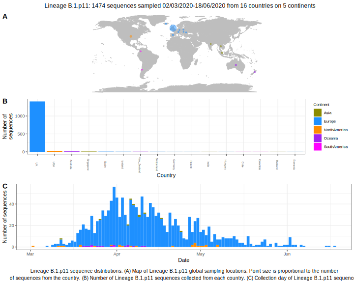

<ul class="actions small">
	 <a href="{{ 'lineages/lineage_B.1.html' | absolute_url }}" class="button special fit">Go to parent lineage: B.1</a>
</ul>

<h3> Lineage summaries</h3>

| Lineage name | Most common countries | Date range | Number of taxa |  Days since last sampling | Known Travel | Recall value |
|:-----|:-----|:-------|-------:|-------:|:---------|--------:|
| <a href="{{ 'lineages/lineage_B.1.p11.html' | absolute_url }}">B.1.p11</a> | UK (98%), USA (2%), Australia (0%) | March 02 to May 08 | 584 | 2 |  | 64.82 |

<h3>Lineage descriptions</h3>

| Lineage | Notes |
|:-----|:-----|
| <a href="{{ 'lineages/lineage_B.1.p11.html' | absolute_url }}">B.1.p11</a> | UK lineage but low support and splitting up, pruned down quite a lot, but may need to be removed next time (BS=31) |

