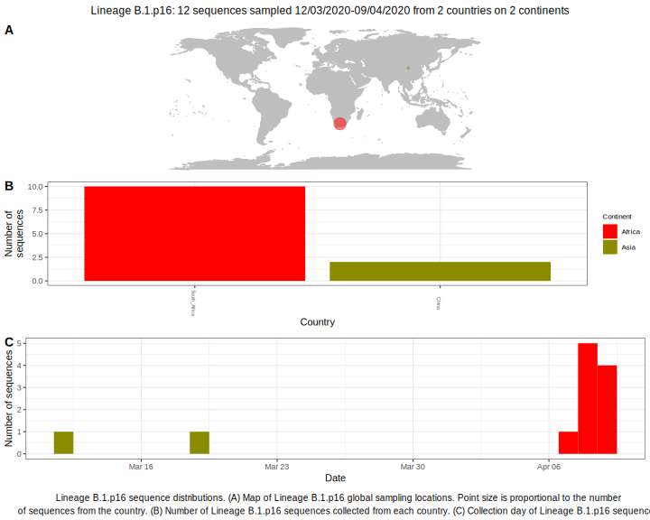

<h2> Lineage summaries</h2>

| Lineage name | Most common countries | Date range | Number of taxa |  Days since last sampling | Known Travel | Recall value |
|:-----|:-----|:-------|-------:|-------:|:---------|--------:|
| B.1.p16 | Belgium (100%) | March 01 to March 20 | 18 | 51 | Italy to Belgium (1)  | 94.74 |

<h2>Lineage descriptions</h2>

| Lineage | Notes |
|:-----|:-----|
| B.1.p16 | Belgium, low support (BS=19), keep an eye on this with new data  |

