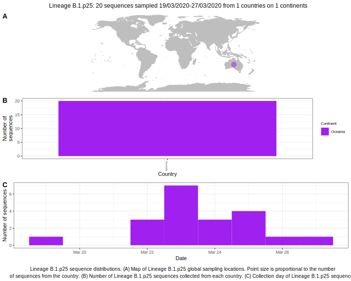

<ul class="actions small">
	 <a href="{{ 'lineages/lineage_B.1.html' | absolute_url }}" class="button special fit">Go to parent lineage: B.1</a>
</ul>

<h3> Lineage summaries</h3>

| Lineage name | Most common countries | Date range | Number of taxa |  Days since last sampling | Known Travel | Recall value |
|:-----|:-----|:-------|-------:|-------:|:---------|--------:|
| <a href="{{ 'lineages/lineage_B.1.p25.html' | absolute_url }}">B.1.p25</a> | Australia (100%) | March 19 to March 27 | 16 | 44 |  | 75.0 |

<h3>Lineage descriptions</h3>

| Lineage | Notes |
|:-----|:-----|
| <a href="{{ 'lineages/lineage_B.1.p25.html' | absolute_url }}">B.1.p25</a> | Australian lineage, some low internal bootstrap values and parent node BS=16. However all sequences within it are Australian and that's with quite a lot of diversity as well. |

