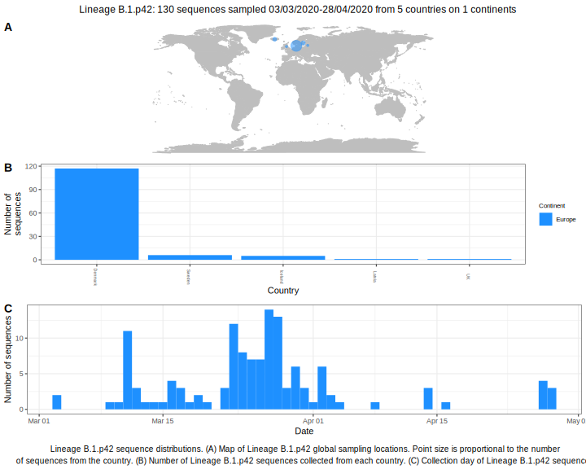

| Lineage | Notes |
|:-----|:-----|
| B.1.p42 | Sweden/ Denmark lineage, split up in the tree this week |

<h2>Lineage B.1.p42 composition summary </h2>

<strong>Total number of sequences:</strong> 63

| Lineage name | Most common countries | Date range | Number of taxa |  Days since last sampling | Known Travel | Recall value |
|:-----|:-----|:-------|-------:|-------:|:---------|--------:|
| B.1.p42 | Denmark (83%), Iceland (8%), Sweden (8%) | March 03 to April 02 | 63 | 38 | Faroe_Islands to Iceland (1)  Denmark to Iceland (2)  UK to Iceland (1)  | 77.78 |
