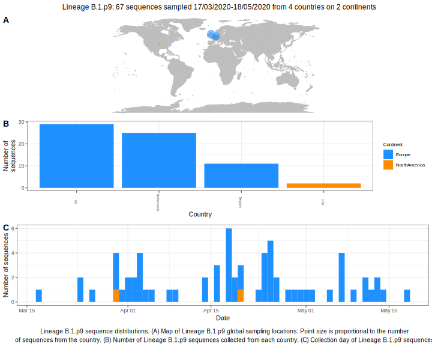

<ul class="actions small">
	 <a href="{{ 'lineages/lineage_B.1.html' | absolute_url }}" class="button special fit">Go to parent lineage: B.1</a>
</ul>

<h3> Lineage summaries</h3>

| Lineage name | Most common countries | Date range | Number of taxa |  Days since last sampling | Known Travel | Recall value |
|:-----|:-----|:-------|-------:|-------:|:---------|--------:|
| <a href="{{ 'lineages/lineage_B.1.p9.html' | absolute_url }}">B.1.p9</a> | Belgium (56%), Turkey (13%), Netherlands (13%) | March 14 to April 17 | 39 | 23 | Saudia_Arabia to Turkey (1)  | 94.44 |

<h3>Lineage descriptions</h3>

| Lineage | Notes |
|:-----|:-----|
| <a href="{{ 'lineages/lineage_B.1.p9.html' | absolute_url }}">B.1.p9</a> | Netherlands/ Belgium/ Turkey/ DRC (BS=9) |

