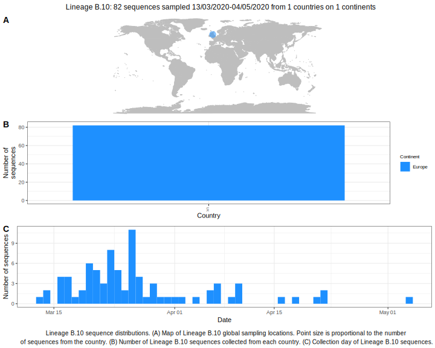

<ul class="actions small">
	 <a href="{{ 'lineages/lineage_B.1.1.1.html' | absolute_url }}" class="button special fit">Go to parent lineage: B</a>
</ul>

<h3> Lineage summaries</h3>

| Lineage name | Most common countries | Date range | Number of taxa |  Days since last sampling | Known Travel | Recall value |
|:-----|:-----|:-------|-------:|-------:|:---------|--------:|
| <a href="{{ 'lineages/lineage_B.10.html' | absolute_url }}">B.10</a> | UK (100%) | March 11 to May 15 | 102 | 99 |  | 0.97 |

<h3>Lineage descriptions</h3>

| Lineage | Notes |
|:-----|:-----|
| <a href="{{ 'lineages/lineage_B.10.html' | absolute_url }}">B.10</a> | Lineage with a lot of representation from sequences in the UK, including Northern Ireland, England and Scotland |

