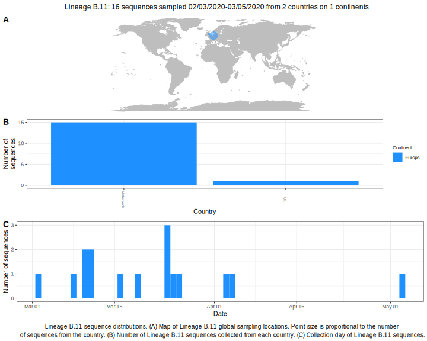

<ul class="actions small">
	 <a href="{{ 'lineages/lineage_B.html' | absolute_url }}" class="button special fit">Go to parent lineage: B</a>
</ul>

<h3> Lineage summaries</h3>

| Lineage name | Most common countries | Date range | Number of taxa |  Days since last sampling | Known Travel | Recall value |
|:-----|:-----|:-------|-------:|-------:|:---------|--------:|
| <a href="{{ 'lineages/lineage_B.11.html' | absolute_url }}">B.11</a> | Netherlands (94%), UK (6%) | March 02 to May 03 | 16 | 93 |  | 1.000 |

<h3>Lineage descriptions</h3>

| Lineage | Notes |
|:-----|:-----|
| <a href="{{ 'lineages/lineage_B.11.html' | absolute_url }}">B.11</a> | Netherlands lineage (BS=83) |

