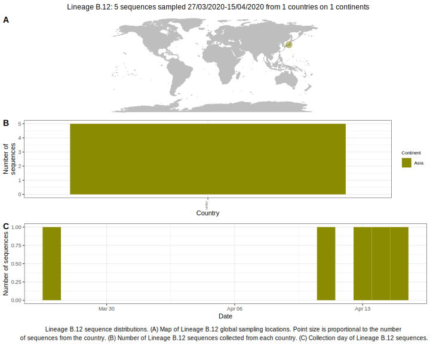

<ul class="actions small">
	 <a href="{{ 'lineages/lineage_B.html' | absolute_url }}" class="button special fit">Go to parent lineage: B</a>
</ul>

<h3> Lineage summaries</h3>

| Lineage name | Most common countries | Date range | Number of taxa |  Days since last sampling | Known Travel | Recall value |
|:-----|:-----|:-------|-------:|-------:|:---------|--------:|
| <a href="{{ 'lineages/lineage_B.12.html' | absolute_url }}">B.12</a> | Japan (97%), Malaysia (3%) | January 20 to April 15 | 34 | 129 |  | 1.0 |

<h3>Lineage descriptions</h3>

| Lineage | Notes |
|:-----|:-----|
| <a href="{{ 'lineages/lineage_B.12.html' | absolute_url }}">B.12</a> | Japan lineage (BS=100) |

