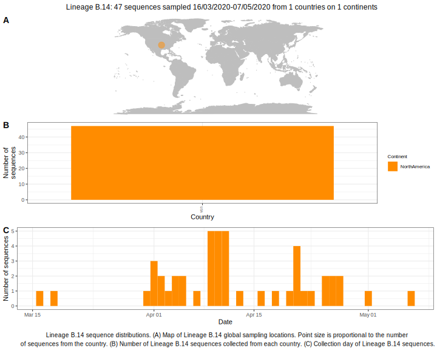

<h2> Lineage summaries</h2>

| Lineage name | Most common countries | Date range | Number of taxa |  Days since last sampling | Known Travel | Recall value |
|:-----|:-----|:-------|-------:|-------:|:---------|--------:|
| B.14 | USA (100%) | March 16 to May 01 | 38 | 9 |  | 97.44 |

<h2>Lineage descriptions</h2>

| Lineage | Notes |
|:-----|:-----|
| B.14 | USA (CA) lineage (BS=100) |

