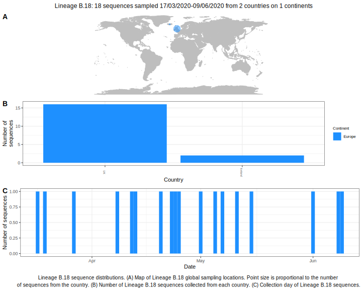

<ul class="actions small">
	 <a href="{{ 'lineages/lineage_B.html' | absolute_url }}" class="button special fit">Go to parent lineage: B</a>
</ul>

<h3> Lineage summaries</h3>

| Lineage name | Most common countries | Date range | Number of taxa |  Days since last sampling | Known Travel | Recall value |
|:-----|:-----|:-------|-------:|-------:|:---------|--------:|
| <a href="{{ 'lineages/lineage_B.18.html' | absolute_url }}">B.18</a> | UK (89%), Iceland (11%) | March 17 to June 09 | 18 | 56 |  | 0.500 |

<h3>Lineage descriptions</h3>

| Lineage | Notes |
|:-----|:-----|
| <a href="{{ 'lineages/lineage_B.18.html' | absolute_url }}">B.18</a> | European lineage (Iceland and England) (BS=95) |

