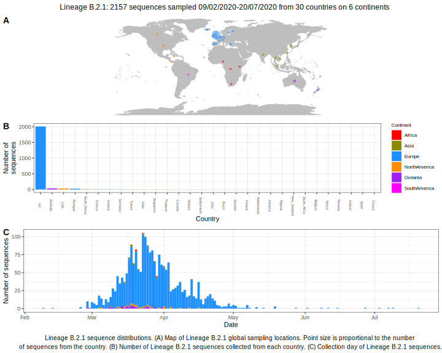

<ul class="actions small">
	 <a href="{{ 'lineages/lineage_B.2.html' | absolute_url }}" class="button special fit">Go to parent lineage: B.2</a>
</ul>

<h3> Lineage summaries</h3>

| Lineage name | Most common countries | Date range | Number of taxa |  Days since last sampling | Known Travel | Recall value |
|:-----|:-----|:-------|-------:|-------:|:---------|--------:|
| <a href="{{ 'lineages/lineage_B.2.1.html' | absolute_url }}">B.2.1</a> | UK (89%), Australia (3%), USA (2%) | February 09 to June 02 | 1618 | 20 | UK to Iceland (1) | 0.992 |

<h3>Lineage descriptions</h3>

| Lineage | Notes |
|:-----|:-----|
| <a href="{{ 'lineages/lineage_B.2.1.html' | absolute_url }}">B.2.1</a> | Large lineage with representation from UK, Europe, Jordan, Australia, USA, India, Ghana (BS=21)  |

