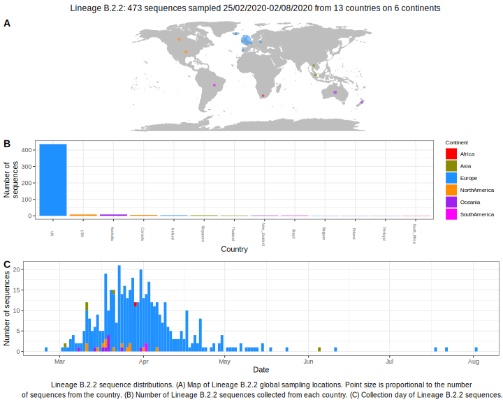

<ul class="actions small">
	 <a href="{{ 'lineages/lineage_B.1.1.1.html' | absolute_url }}" class="button special fit">Go to parent lineage: B.2</a>
</ul>

<h3> Lineage summaries</h3>

| Lineage name | Most common countries | Date range | Number of taxa |  Days since last sampling | Known Travel | Recall value |
|:-----|:-----|:-------|-------:|-------:|:---------|--------:|
| <a href="{{ 'lineages/lineage_B.2.2.html' | absolute_url }}">B.2.2</a> | UK (90%), USA (2%), Australia (2%) | February 25 to August 02 | 345 | 20 | Switzerland to Iceland (1) | 0.98 |

<h3>Lineage descriptions</h3>

| Lineage | Notes |
|:-----|:-----|
| <a href="{{ 'lineages/lineage_B.2.2.html' | absolute_url }}">B.2.2</a> | Lineage with representation from UK/ USA/ Australia |

