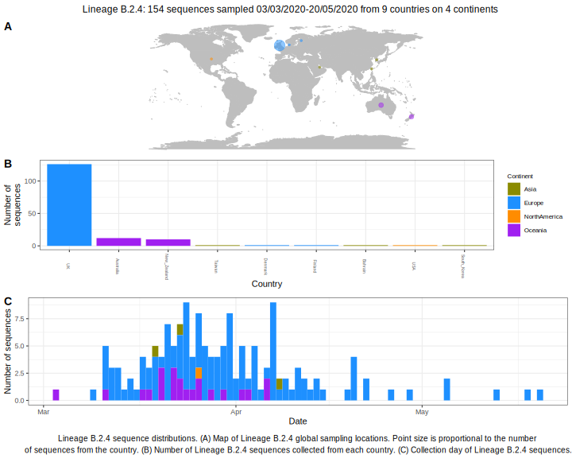

<ul class="actions small">
	 <a href="{{ 'lineages/lineage_B.2.html' | absolute_url }}" class="button special fit">Go to parent lineage: B.2</a>
</ul>

<h3> Lineage summaries</h3>

| Lineage name | Most common countries | Date range | Number of taxa | Known Travel | Recall value |
|:-----|:-----|:-------|-------:|-------:|:---------|--------:|
| <a href="{{ 'lineages/lineage_B.2.4.html' | absolute_url }}">B.2.4</a> | UK (81%), New_Zealand (8%), Australia (6%) | March 03 to May 20 | 187 |  | 0.99 |

<h3>Lineage descriptions</h3>

| Lineage | Notes |
|:-----|:-----|
| <a href="{{ 'lineages/lineage_B.2.4.html' | absolute_url }}">B.2.4</a> | England/ Australia/ New Zealand lineage (BS=94) |

