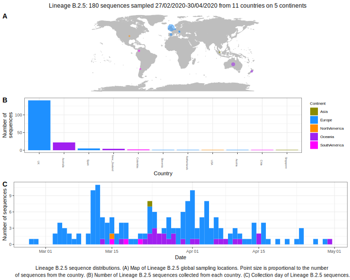

| Lineage | Notes |
|:-----|:-----|
| B.2.5 | Spain/ England / Australia (BS=17) *flagged because of low bootstrap |

<h2>Lineage B.2.5 composition summary </h2>

<strong>Total number of sequences:</strong> 143

| Lineage name | Most common countries | Date range | Number of taxa |  Days since last sampling | Known Travel | Recall value |
|:-----|:-----|:-------|-------:|-------:|:---------|--------:|
| B.2.5 | UK (86%), Australia (10%), Slovenia (1%) | February 27 to April 27 | 143 | 13 |  | 99.3 |
