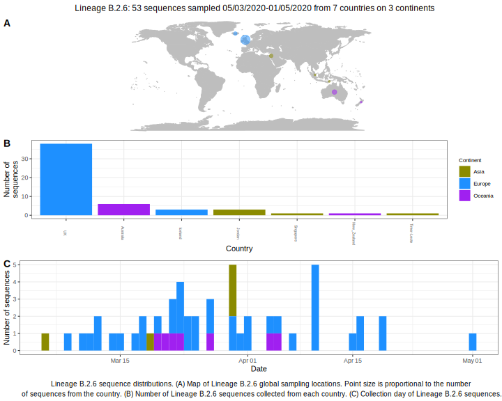

<h2> Lineage summaries</h2>

| Lineage name | Most common countries | Date range | Number of taxa |  Days since last sampling | Known Travel | Recall value |
|:-----|:-----|:-------|-------:|-------:|:---------|--------:|
| B.2.6 | UK (77%), Australia (9%), Iceland (6%) | March 05 to May 04 | 47 | 6 |  | 97.92 |

<h2>Lineage descriptions</h2>

| Lineage | Notes |
|:-----|:-----|
| B.2.6 | UK/ Singapore/ Jordan/ Iceland, previously just UK & Australia (BS=11, low support) |

