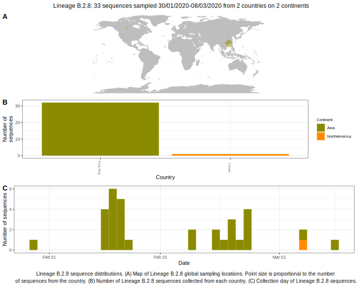

<ul class="actions small">
	 <a href="{{ 'lineages/lineage_B.2.html' | absolute_url }}" class="button special fit">Go to parent lineage: B.2</a>
</ul>

<h3> Lineage summaries</h3>

| Lineage name | Most common countries | Date range | Number of taxa |  Days since last sampling | Known Travel | Recall value |
|:-----|:-----|:-------|-------:|-------:|:---------|--------:|
| <a href="{{ 'lineages/lineage_B.2.8.html' | absolute_url }}">B.2.8</a> | Hong_Kong (97%), Canada (3%) | January 30 to March 09 | 34 | 148 |  | 0.750 |

<h3>Lineage descriptions</h3>

| Lineage | Notes |
|:-----|:-----|
| <a href="{{ 'lineages/lineage_B.2.8.html' | absolute_url }}">B.2.8</a> | Hong Kong lineage reassigned from B.7 (BS=75) |

