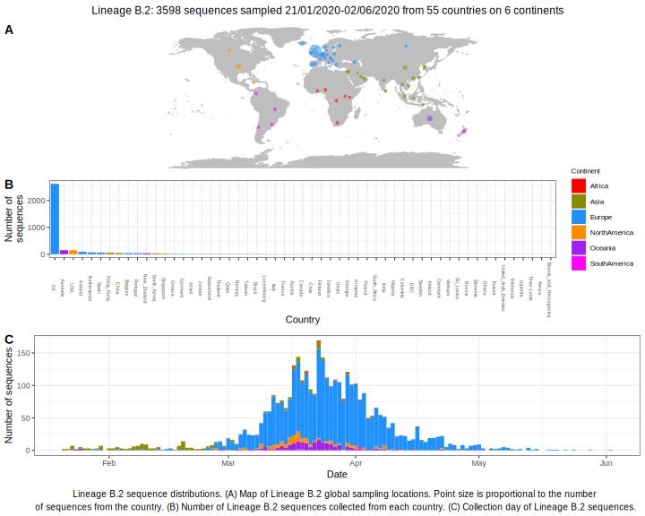

<ul class="actions small">
	 <a href="{{ 'lineages/lineage_B.html' | absolute_url }}" class="button special fit">Go to parent lineage: B</a>
</ul>

<h3> Lineage summaries</h3>

| Lineage name | Most common countries | Date range | Number of taxa |  Days since last sampling | Known Travel | Recall value |
|:-----|:-----|:-------|-------:|-------:|:---------|--------:|
| <a href="{{ 'lineages/lineage_B.2.html' | absolute_url }}">B.2</a> | UK (64%), USA (8%), Australia (4%) | January 21 to July 22 | 1997 | 13 |  | 0.978 |
| <a href="{{ 'lineages/lineage_B.2.1.html' | absolute_url }}">B.2.1</a> | UK (90%), Australia (3%), USA (2%) | February 09 to July 20 | 2173 | 15 |  | 0.995 |
| <a href="{{ 'lineages/lineage_B.2.10.html' | absolute_url }}">B.2.10</a> | South_Korea (98%), USA (2%) | February 17 to April 01 | 109 | 125 |  | 1.000 |
| <a href="{{ 'lineages/lineage_B.2.2.html' | absolute_url }}">B.2.2</a> | UK (85%), Australia (4%), USA (4%) | February 25 to May 24 | 352 | 72 |  | 1.000 |
| <a href="{{ 'lineages/lineage_B.2.4.html' | absolute_url }}">B.2.4</a> | UK (67%), New_Zealand (15%), Australia (14%) | March 03 to May 20 | 173 | 76 |  | 0.963 |
| <a href="{{ 'lineages/lineage_B.2.6.html' | absolute_url }}">B.2.6</a> | UK (77%), Australia (9%), Iceland (5%) | March 05 to May 04 | 66 | 92 |  | 0.923 |
| <a href="{{ 'lineages/lineage_B.2.7.html' | absolute_url }}">B.2.7</a> | Iceland (100%) | March 12 to March 29 | 46 | 128 |  | 0.929 |
| <a href="{{ 'lineages/lineage_B.2.8.html' | absolute_url }}">B.2.8</a> | Hong_Kong (97%), Canada (3%) | January 30 to March 09 | 34 | 148 |  | 0.750 |
| <a href="{{ 'lineages/lineage_B.2.9.html' | absolute_url }}">B.2.9</a> | UK (100%) | March 18 to May 01 | 39 | 95 |  | 0.875 |

<h3>Lineage descriptions</h3>

| Lineage | Notes |
|:-----|:-----|
| <a href="{{ 'lineages/lineage_B.2.html' | absolute_url }}">B.2</a> | A large lineage that now includes B.7 as a sublineage within it. Diversity within Hong Kong and Europe (BS=20) |
| <a href="{{ 'lineages/lineage_B.2.1.html' | absolute_url }}">B.2.1</a> | Large lineage with representation from UK, Europe, Jordan, Australia, USA, India, Ghana (BS=21)  |
| <a href="{{ 'lineages/lineage_B.2.10.html' | absolute_url }}">B.2.10</a> | Korean lineage (BS=57) |
| <a href="{{ 'lineages/lineage_B.2.2.html' | absolute_url }}">B.2.2</a> | UK/ USA/ Australia (BS=30) |
| <a href="{{ 'lineages/lineage_B.2.4.html' | absolute_url }}">B.2.4</a> | England/ Australia/ New Zealand lineage (BS=94) |
| <a href="{{ 'lineages/lineage_B.2.5.html' | absolute_url }}">B.2.5</a> | Reassigned to B.2 this week, consistently low support with similar metadata now present in parent lineage. |
| <a href="{{ 'lineages/lineage_B.2.6.html' | absolute_url }}">B.2.6</a> | UK lineage (BS=100) |
| <a href="{{ 'lineages/lineage_B.2.7.html' | absolute_url }}">B.2.7</a> | Iceland lineage (BS=71) |
| <a href="{{ 'lineages/lineage_B.2.8.html' | absolute_url }}">B.2.8</a> | Hong Kong lineage reassigned from B.7 (BS=75) |
| <a href="{{ 'lineages/lineage_B.2.9.html' | absolute_url }}">B.2.9</a> | UK lineage (BS=85) |

