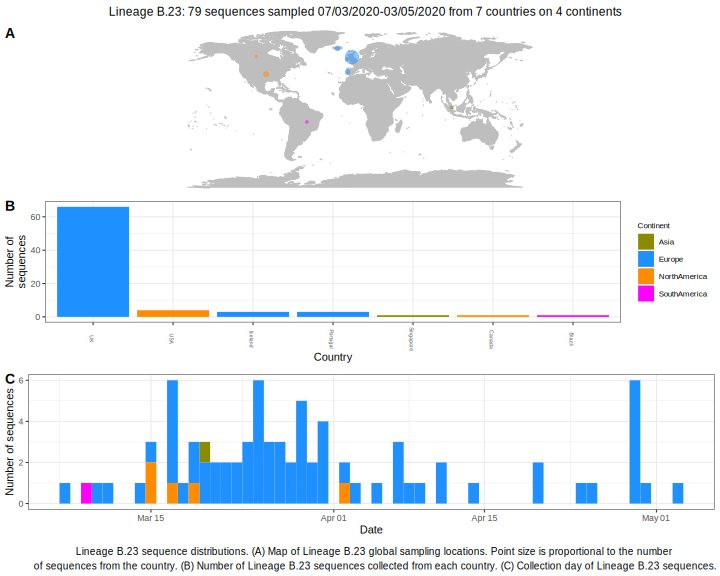

<ul class="actions small">
	 <a href="{{ 'lineages/lineage_B.html' | absolute_url }}" class="button special fit">Go to parent lineage: B</a>
</ul>

<h3> Lineage summaries</h3>

| Lineage name | Most common countries | Date range | Number of taxa | Known Travel | Recall value |
|:-----|:-----|:-------|-------:|-------:|:---------|--------:|
| <a href="{{ 'lineages/lineage_B.23.html' | absolute_url }}">B.23</a> | UK (96%), Iceland (1%), Portugal (1%) | February 28 to June 16 | 340 | UK to Iceland (1), Austria to Iceland (1) | 0.98 |

<h3>Lineage descriptions</h3>

| Lineage | Notes |
|:-----|:-----|
| <a href="{{ 'lineages/lineage_B.23.html' | absolute_url }}">B.23</a> | Lineage with representation from mainly UK sequences, but also sequences from Portugal, Iceland and Brazil   |

