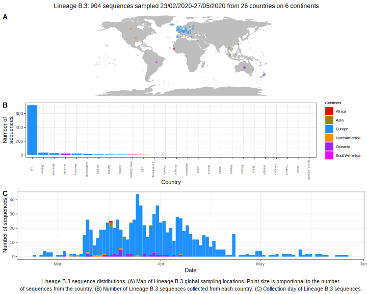

<ul class="actions small">
	 <a href="{{ 'lineages/lineage_B.html' | absolute_url }}" class="button special fit">Go to parent lineage: B</a>
</ul>

<h3> Lineage summaries</h3>

| Lineage name | Most common countries | Date range | Number of taxa |  Days since last sampling | Known Travel | Recall value |
|:-----|:-----|:-------|-------:|-------:|:---------|--------:|
| <a href="{{ 'lineages/lineage_B.3.html' | absolute_url }}">B.3</a> | UK (89%), Belgium (2%), Australia (1%) | February 23 to August 03 | 1123 | Austria to Iceland (1) | 0.99 |

<h3>Lineage descriptions</h3>

| Lineage | Notes |
|:-----|:-----|
| <a href="{{ 'lineages/lineage_B.3.html' | absolute_url }}">B.3</a> | A European lineage with a lot of Welsh sequences |

