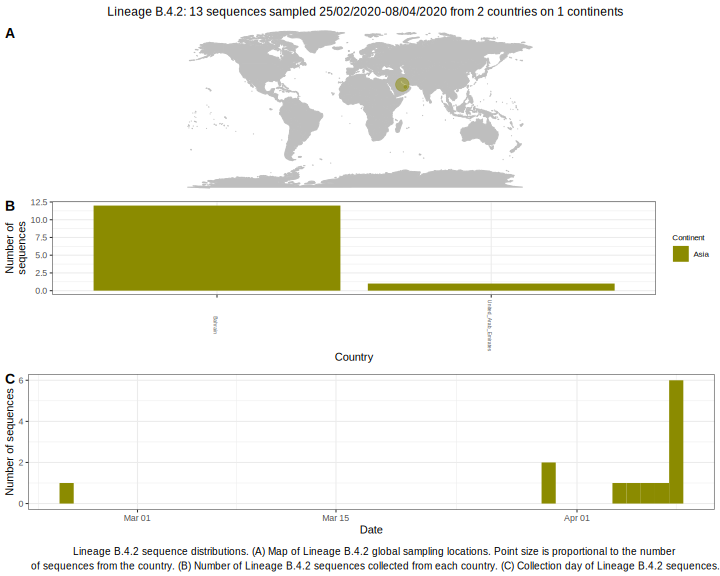

<ul class="actions small">
	 <a href="{{ 'lineages/lineage_B.4.html' | absolute_url }}" class="button special fit">Go to parent lineage: B.4</a>
</ul>

<h3> Lineage summaries</h3>

| Lineage name | Most common countries | Date range | Number of taxa |  Days since last sampling | Known Travel | Recall value |
|:-----|:-----|:-------|-------:|-------:|:---------|--------:|
| <a href="{{ 'lineages/lineage_B.4.2.html' | absolute_url }}">B.4.2</a> | Bahrain (92%), United_Arab_Emirates (8%) | February 25 to April 08 | 13 |  | 1.0 |

<h3>Lineage descriptions</h3>

| Lineage | Notes |
|:-----|:-----|
| <a href="{{ 'lineages/lineage_B.4.2.html' | absolute_url }}">B.4.2</a> | A lineage with mostly sequences from Bahrein |

