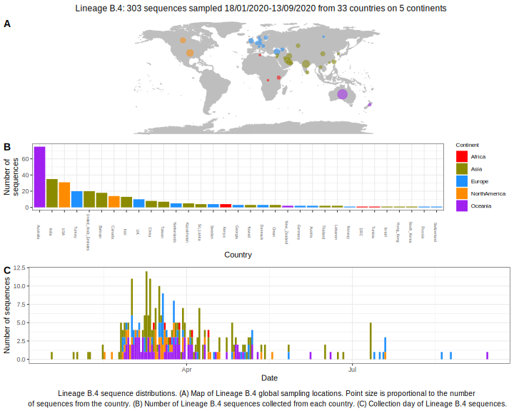

<ul class="actions small">
	 <a href="{{ 'lineages/lineage_B.html' | absolute_url }}" class="button special fit">Go to parent lineage: B</a>
</ul>

<h3> Lineage summaries</h3>

| Lineage name | Most common countries | Date range | Number of taxa | Known Travel | Recall value |
|:-----|:-----|:-------|-------:|-------:|:---------|--------:|
| <a href="{{ 'lineages/lineage_B.4.html' | absolute_url }}">B.4</a> | UK (20%), Australia (17%), India (12%) | January 18 to October 12 | 301 | Iran to Turkey, Lebanon, Canada, New_Zealand, Australia (7), UK to Lebanon (1), Italy to China (1), France to China (1) | 0.95 |
| <a href="{{ 'lineages/lineage_B.4.1.html' | absolute_url }}">B.4.1</a> | Kazakhstan (100%) | April 19 to April 26 | 10 |  | 1.0 |
| <a href="{{ 'lineages/lineage_B.4.2.html' | absolute_url }}">B.4.2</a> | Bahrain (92%), United_Arab_Emirates (8%) | February 25 to April 08 | 13 |  | 1.0 |
| <a href="{{ 'lineages/lineage_B.4.3.html' | absolute_url }}">B.4.3</a> | Australia (100%) | March 10 to May 10 | 24 |  | 0.83 |

<h3>Lineage descriptions</h3>

| Lineage | Notes |
|:-----|:-----|
| <a href="{{ 'lineages/lineage_B.4.html' | absolute_url }}">B.4</a> | Iran lineage, many sequences we have of this lineage are associated with travel histories from Iran. Significant number of sequences from the UAE, Kenya and Australia |
| <a href="{{ 'lineages/lineage_B.4.1.html' | absolute_url }}">B.4.1</a> | A small lineage from Kazakhstan within the B.4 diversity  |
| <a href="{{ 'lineages/lineage_B.4.2.html' | absolute_url }}">B.4.2</a> | A lineage with mostly sequences from Bahrein |
| <a href="{{ 'lineages/lineage_B.4.3.html' | absolute_url }}">B.4.3</a> | Australian lineage nested within the diversity of B.4 |

