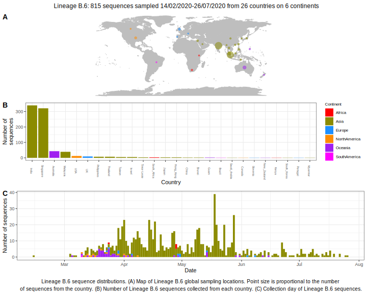

<ul class="actions small">
	 <a href="{{ 'lineages/lineage_B.html' | absolute_url }}" class="button special fit">Go to parent lineage: B</a>
</ul>

<h3> Lineage summaries</h3>

| Lineage name | Most common countries | Date range | Number of taxa |  Days since last sampling | Known Travel | Recall value |
|:-----|:-----|:-------|-------:|-------:|:---------|--------:|
| <a href="{{ 'lineages/lineage_B.6.html' | absolute_url }}">B.6</a> | India (43%), Singapore (40%), Australia (5%) | February 14 to July 26 | 799 | Philippines to Taiwan (1), Pakistan to China (1) | 0.98 |
| <a href="{{ 'lineages/lineage_B.6.1.html' | absolute_url }}">B.6.1</a> | Malaysia (94%), Brunei (6%) | March 21 to May 04 | 16 |  | 0.62 |

<h3>Lineage descriptions</h3>

| Lineage | Notes |
|:-----|:-----|
| <a href="{{ 'lineages/lineage_B.6.html' | absolute_url }}">B.6</a> | Indian and Singapore lineage with global diversity. Within this lineage, Indian sequences are the majority of the sequences present at the base of the lineage. Towards the tips, there is a greater representation of sequences derived from Singapore. There is also representation from South East Asia/ North America/ Europe/ Israel/ Gambia/ Timor-leste |
| <a href="{{ 'lineages/lineage_B.6.1.html' | absolute_url }}">B.6.1</a> | Malaysian lineage |

