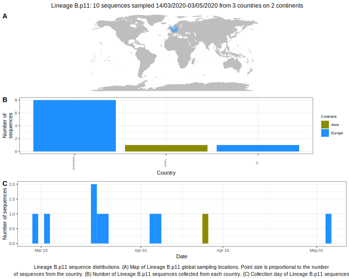

<h2> Lineage summaries</h2>

| Lineage name | Most common countries | Date range | Number of taxa |  Days since last sampling | Known Travel | Recall value |
|:-----|:-----|:-------|-------:|-------:|:---------|--------:|
| B.p11 | Netherlands (100%) | March 02 to March 24 | 14 | 47 |  | 93.33 |

<h2>Lineage descriptions</h2>

| Lineage | Notes |
|:-----|:-----|
| B.p11 | Netherlands lineage (BS=100) |

