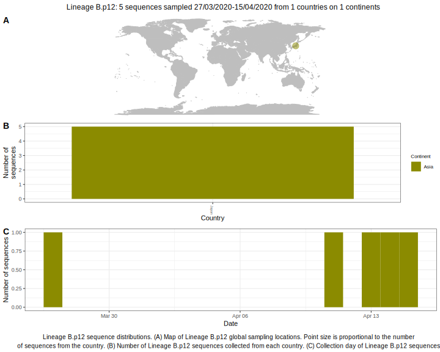

| Lineage | Notes |
|:-----|:-----|
| B.p12 | Japan lineage (BS=99, but only a few sequences) |

<h2>Lineage B.p12 composition summary </h2>

<strong>Total number of sequences:</strong> 4

| Lineage name | Most common countries | Date range | Number of taxa |  Days since last sampling | Known Travel | Recall value |
|:-----|:-----|:-------|-------:|-------:|:---------|--------:|
| B.p12 | Japan (100%) | March 25 to March 27 | 4 | 44 |  | 100.0 |
