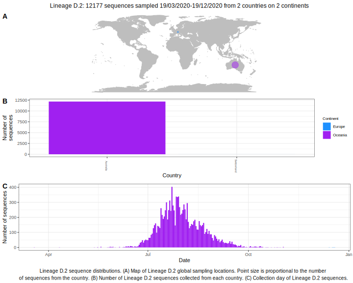

<ul class="actions small">
	 <a href="{{ 'lineages/lineage_B.1.1.25.html' | absolute_url }}" class="button special fit">Go to parent lineage: B.1.1.25</a>
</ul>

<h3> Lineage summaries</h3>

| Lineage name | Most common countries | Date range | Number of taxa | Known Travel | Recall value |
|:-----|:-----|:-------|-------:|-------:|:---------|--------:|
| <a href="{{ 'lineages/lineage_D.2.html' | absolute_url }}">D.2</a> | Australia (100%) | March 19 to August 05 | 49 |  | 0.98 |

<h3>Lineage descriptions</h3>

| Lineage | Notes |
|:-----|:-----|
| <a href="{{ 'lineages/lineage_D.2.html' | absolute_url }}">D.2</a> | Australian lineage (Alias of B.1.1.25.1) |

