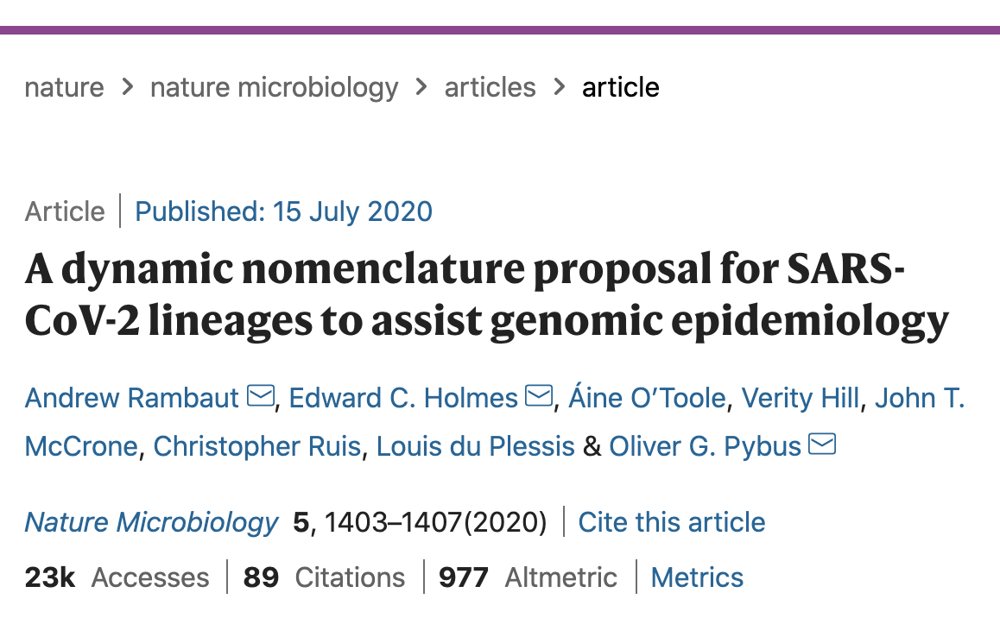
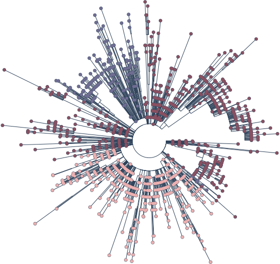
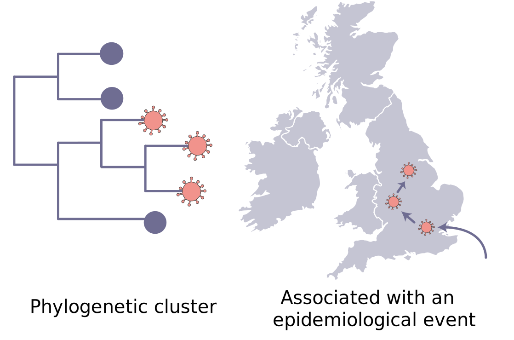
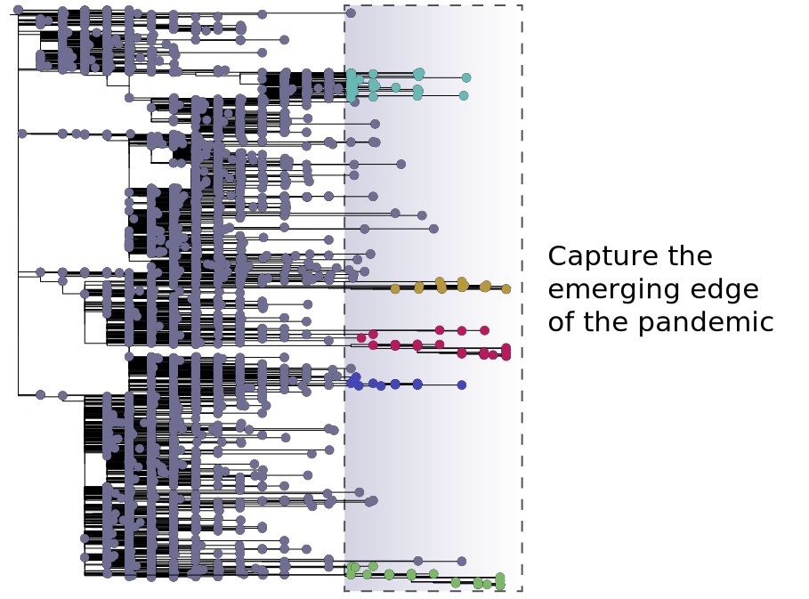
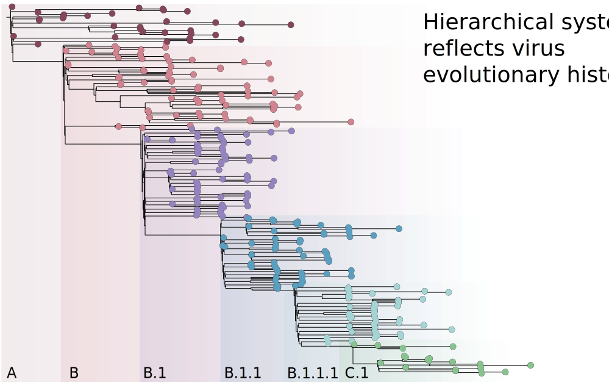

  <section>
    

      <header>
        <h1>Pango lineages</h1>
        
A dynamic nomenclature proposal for SARS-CoV-2 lineages to assist genomic epidemiology

      </header>
    

  </section>
  <section>
    

        <article>
            
            <h3>Rambaut et al. 2020</h3>
        </article>
        <article>
            
            <h3>Latest Pango lineages</h3>
        </article>
      

    </section>

### What is a lineage?

As described in Rambaut et al. (2020), a Pango lineage is as a cluster of sequences that are associated with an epidemiological event, for instance an introduction of the virus into a distinct geographic area with evidence of onward spread. Lineages are designed to capture the emerging edge of the pandemic and are at a fine-grain resolution suitable to genomic epidemiological surveillance and outbreak investigation.

<section>
    

    
    

    
    

    
    

</section>